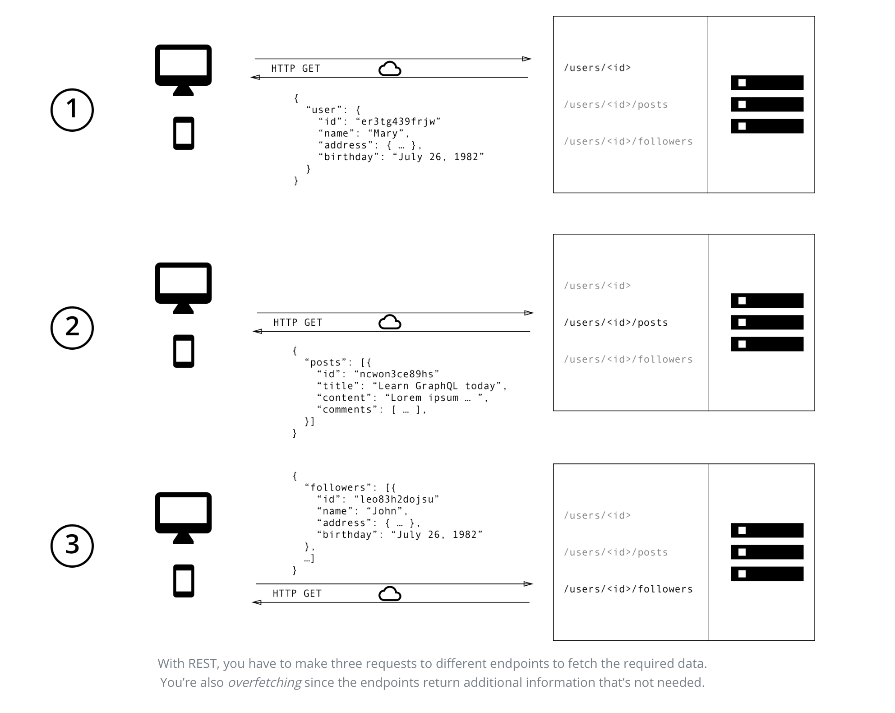

> * 原文地址：[GraphQL is the better REST](https://www.howtographql.com/basics/1-graphql-is-the-better-rest/)
> * 译文来自：[Github:EmilyQiRabbit](https://github.com/EmilyQiRabbit/GraphQLTranslation)
> * 译者：[Yuqi🌸](https://github.com/EmilyQiRabbit)
> * **欢迎校对** 🙋‍♀️🎉

# GraphQL 是更好的 REST

在过去的十几年中，[REST](https://en.wikipedia.org/wiki/Representational_state_transfer) 成为了设计 web API 的标准（但同时 REST 也存在争议）。它确实提供了很多非常棒的思想：比如**无状态服务**和**结构化的资源访问**。但是现在客户端对数据需求的变化非常迅速，REST API 就显得不够灵活了，它已经无法跟上客户端的变化。

于是，为了满足这种对于灵活性和高效率的需求，GraphQL 出现了！它解决了很多与 REST API 交互时会面临的缺点和低效的问题。

为了更清楚的说明 REST 和 GraphQL 在从 API 获取数据时候的主要区别，让我们假设这样一个很简单的情境：在一个博客应用中，需要展示特定作者的博客标题。同时，还要显示最近关注了这个作者的三个粉丝的名字。REST 和 GraphQL 分别都是如何解决这个问题的呢？

> 看看[这篇文章](https://blog.graph.cool/b60cfa683511)，你就知道为什么开发者喜欢 GraphQL 了。

## 分别使用 REST 和 GraphQL 获取数据

使用 REST API 时，你通常会通过访问多个接口来收集数据。在这个例子中，需要访问 `/users/<id>` 来获取用户信息。然后访问类似 `/users/<id>/posts` 这样的接口来获取用户所有的博客信息。再然后，还要访问第三个接口 `/users/<id>/followers`，它将会返回关注了这个用户所有的粉丝。

而如果是 GraphQL 呢，那么你只需要向 GraphQL 服务发送一个简单的请求，这个请求包含了具体的数据需求。然后服务就会返回一个 JSON 对象，满足所有这些数据需求。

## 再不会有数据的过度/不足获取

REST 最大的问题就是可能会过度获取数据或者获取的数据不够。这是由于客户端获取数据的唯一途径，是访问返回**固定的**数据结构的接口。REST 很难设计一个能够满足所有客户端需求的数据格式的 API。

> “使用图的思路，而不是接口的思路。” —— 选自[Lessons From 4 Years of GraphQL](https://www.graphql.com/articles/4-years-of-graphql-lee-byron)，作者是 [Lee Byron](https://twitter.com/leeb)，GraphQL 的合作发明者。

### 数据的过度获取：加载冗余数据

数据的过度获取意味着客户端加载了并不需要数据。例如，界面上仅需要显示用户名列表，但是如果使用 REST API，客户端只能访问 `/users` 接口然后接受返回的 JSON 数组格式的用户数据。接口的返回值可能包括了除了用户名之外的信息，比如生日或者地址等等 —— 这些对客户端并没有什么用，它只需要用户名而已。

### 数据获取不足和 n+1 问题

另一个问题是数据获取不足和 n+1 请求。获取不足意味着特定的接口无法提供足够的信息。那么客户端只能发起更多的请求来获取它需要的所有数据。这个情况可能升级为：客户端需要先请求一个元素列表，然后还要发起另一个附加的请求来获取每个元素的数据。

例如，假设某个应用需要显示每个用户最新的三个粉丝。API 提供了接口 `/users/<user-id>/followers`。那么为了能够显示所有需要的信息，客户端应用需要首先对 `/users` 接口发起请求，然后再请求 `/users/<user-id>/followers` 来获取每个用户的粉丝信息。

## 前端产品的快速迭代

使用 REST API 的一般模式是根据应用界面的需求来构建后台的接口。这样会很方便，客户端在特定页面直接向对应的接口发起请求，就可以获取到所有需要的信息了。

这种方法的缺点就是它不允许前端快速迭代。UI 的每次更改都很有可能同时改变对数据的需求。那么结果就是后端也需要作出相应的调整来满足前端新的需要。这太没效率了，也就显着降低了用户反馈改善产品的能力。

而如果使用 GraphQL，这些问题都能得到解决。GraphQL 非常灵活，即使客户端的需求改变，也不需要对服务端做任何修改。客户端可以根据需求自己定义数据格式，而后端工程师完全不需要对此作出任何调整。

## 后端的深度分析

GraphQL 让你可以以很细的粒度检查前端向后端请求的数据。因为每个客户端都会指定它们感兴趣的特定信息，所以深入了解这些数据是如何被利用的也就成为了可能。这能帮助 API 更新换代，并且如果某些数据从没有被客户端请求过，它就可以删掉了。

GraphQL 还能帮助你监控服务端遇到的低性能请求。GraphQL 使用 resolver 函数的概念来收集客户端请求的数据。分析和测量这些 resolvers 的性能能够提供给你有关系统瓶颈的重要信息。

## Schema & Type 系统的优势

GraphQL 使用强类型系统来定义 API 功能。API 所暴露的类型都用 SDL（即 GraphQL Schema Definition Language）定义在一个 schema 文件里。这个 schema 文件将作为服务端和客户端之间的协议，由它定义客户端如何获取数据。

一旦定义了 schema，前端团队和后端团队就可以开始并行开发了，他们不需要更多的沟通。因为他们都已经很清楚需要通过网络传送的数据结构了。

前端团队可以先通过模拟（mocking）数据而轻松的测试应用。而一旦服务端也准备好，前端团队就可以改为从后端接口获取数据了。
