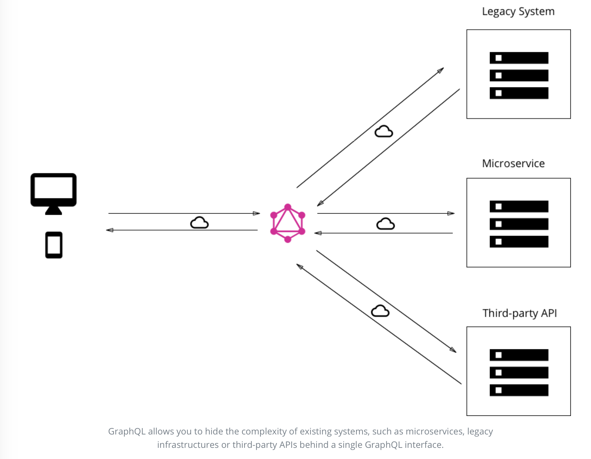
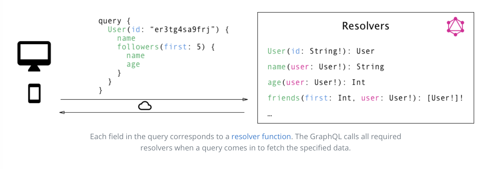

> * 原文地址：[Big Picture (Architecture)](https://www.howtographql.com/basics/3-big-picture/)
> * 译文来自：[Github:EmilyQiRabbit](https://github.com/EmilyQiRabbit/GraphQLTranslation)
> * 译者：[Yuqi🌸](https://github.com/EmilyQiRabbit)
> * **欢迎校对** 🙋‍♀️🎉

# GraphQL 总览（架构）

GraphQL 仅仅作为一种规范而发行。这就意味着，实际上 GraphQL 就是一份详细描述 GraphQL 服务应该如何运作的[长篇文档](https://graphql.github.io/graphql-spec/)。

## 使用案例

本章我们将会学习 3 种不同的包含 GraphQL 服务的架构：

1. 可连接数据库的 GraphQL 服务

2. GraphQL 作为中间层，通过一个 GraphQL API 整合多个第三方或者遗留系统

3. 连接数据库与整合第三方或遗留系统的混合使用，它们可用同一个 GraphQL API 完成

这三个案例代表了 GraphQL 的三个最主要的用途，在这些案例中，GraphQL 展现了非凡的灵活性。

### 1、可连接数据库的 GraphQL 服务

这种架构将会是新建项目时最常见的架构。在项目的安装过程中，你有一个 web 服务应用了 GraphQL 规范。当有 query 请求到达 GraphQL 服务时，服务就会读取这个 query 携带的的数据负载（payload），然后从数据库获取到需要的信息。这称为对 query 的解析（resolve）。随后，GraphQL 服务将会[像官方文档里描述的那样，构建出应答对象](http://facebook.github.io/graphql/October2016/)，并返回给客户端。

需要我们注意的很重要的一点是，GraphQL 是对传输层透明的。这就意味着不管传输层使用任何网络协议，不论网络是基于 TCP 或者 WebSocket，GraphQL 都可以被使用。

GraphQL 也能兼容所有的数据库的类型和数据库存储数据的格式。你可以选择 SQL 数据库，例如 [AWS Aurora](https://aws.amazon.com/rds/aurora)，或者非 SQL 数据库，例如 [MongoDB](https://www.mongodb.com)。

### 2、整合已有系统的 GraphQL 层

GraphQL 的另一个主要用途是，将多个已经存在的系统整合到一个 GraphQL API 的后一层。这对于那些有历史遗留基础架构和许多不同的、存在好多年的、并且现在维护成本非常高的 API 的公司来说，这一点尤其有吸引力。这些遗留系统存在的一个主要的问题就是，它们使得创建一个需要连接多个系统的革命性产品变得基本上不可能。

在这种情况下，GraphQL 能够将这些系统整合，用一层 GraphQL API 把那些复杂的接口包起来并隐藏起来。这样，新的客户端应用只需要简单地和 GraphQL 服务交互并获取数据。由 GraphQL 服务负责从已有系统获取数据，然后打包数据为 GraphQL 应答地格式，返回给客户端。

和前面的架构一样，GraphQL 服务不仅不关心数据库类型，它也不关心从什么数据源中获取数据，从而解析它收到的请求。

### 3、连接数据库和集成已有系统的混合使用

最后，将上面这两种方式结合，建立一个可以同时连接数据库，并同时整合第三方系统的 GraphQL API。

当服务端接收到一个请求，它将会要么从连接到的数据库，要么从其他 API 来获取所需数据，从而解析该请求。

## resolver 函数

我们是如何利用 GraphQL 获取到了如此的便利呢？为什么 GraphQL 能适用于这些区别很大、各不相同的场景呢？

正如你在前面的章节学到的那样，GraphQL 的 query / mutation 请求的数据负载（payload）包含了一系列的字段。在 GraphQL 服务的真实代码中，每一个 field 实际上会和一个特定的函数相对应，这个函数就称为 resolver。每个 resolver 函数只有一个功能，那就是获取它所对应的字段的数据。

每当服务端收到一个 query 请求，它就会调用 query 的数据负载中指定的字段对应的所有函数。这样，query 就得到了解析，从而能够为每一个字段取回数据。一旦所有的 resolver 函数都返回了，服务器就将数据打包为 query 要求的格式，然后发回客户端。

## GraphQL 客户端可用的库

GraphQL 是前端开发者的福音，它彻底消除了使用 REST API 开发的的很多缺点和不便，比如会获取多余或者不足的数据。复杂的操作都被放在服务端，因为服务端可以使用一些强大的设备来承载大量的计算。客户端不需要知道它获取的数据是从哪里来的，它只需要一个连接服务端的灵活接口。

让我们来看看 GraphQL 带来了怎样的改变，即将命令式数据获取方法，变成了纯粹的声明式方法。如果使用 REST API 来获取数据，大部分的应用都需要如下几步：

1. 建立并发送 HTTP 请求（例如 Javascript 的 `fetch`）
2. 获取并解析服务器响应
3. 将数据本地存储（仅仅是暂时存在内存中或者永久保存）
4. 渲染到 UI

如果用了声明式的数据获取方式，客户端只需要下面两步：

1. 描述数据需求
2. 渲染到 UI

所有低级别的网络请求还有本地存储数据都应该被精简掉，数据声明才应该是最重要的部分。

这恰恰就是 GraphQL 客户端的库例如 Relay、Apollo 能够让你做的事。它们能帮你精简开发，从而让你能够专注于应用中最重要的业务逻辑，而不是费心于那些重复的基础代码。
