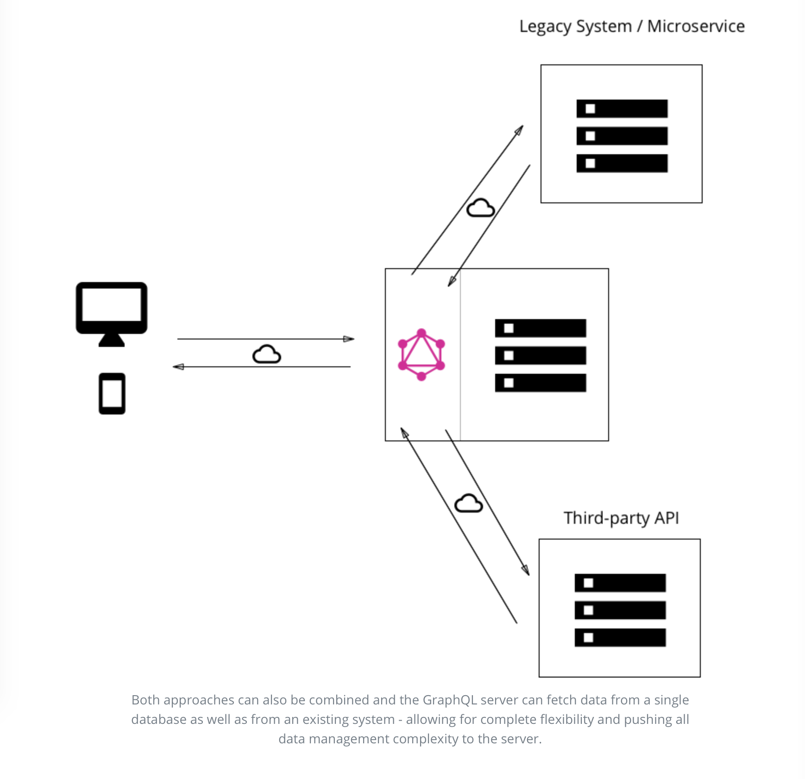

> * 原文地址：[Big Picture (Architecture)](https://www.howtographql.com/basics/3-big-picture/)
> * 译文来自：[Github:EmilyQiRabbit](https://github.com/EmilyQiRabbit/GraphQLTranslation)
> * 译者：[旺财](https://github.com/EmilyQiRabbit)
> * **Proofreading is welcomed** 🙋 🎉

# 架构

最初 GraphQL 发行的时候只是作为一种规范。这就意味着，GraphQL 实际上就是一个描述 GraphQL server 应该如何运作的长篇文档。

如果你想使用 GraphQL，就需要自己创建一个 GraphQL 服务。随便[从这里](http://graphql.org/code/)选一个什么语言都可以完成这个任务，或者可以直接用像是 [Graphcool](http://www.graph.cool) 这样能够提供强大的 GraphQL API 的开箱即用的服务。

## 使用案例

这一章我们将会带你学习三种不同的包括了 GraphQL 服务的架构：

1. GraphQL 服务连接数据库

2. GraphQL 作为一个中间层，使用一个 GraphQL API 整合一些第三方或者遗留系统

3. 链接数据库、整合第三方或遗留系统的混合使用，这些都可以用同一个 GraphQL API 完成

这三个案例代表了 GraphQL 的三个最主要的用途，在这些案例中，GraphQL 展现了非凡的灵活性。

### 1、连接数据库

对于一个几乎还没动工的工程，这个架构的使用再正常不过了。在安装过程中，你有一个 web 服务器应用了 GraphQL 规范。当有请求（query）到达 GraphQL 服务，服务就读取这个请求携带的的信息（payload），然后从数据库拉取需要的信息。这称为请求的解析（resolve）。然后，GraphQL 服务将会[像官方文档里描述的那样，构建应答对象](http://facebook.github.io/graphql/October2016/)，然后返回给客户端。

注意：GraphQL 实际上是传输层不可知的。这就意味着它可以被用于任何网络协议。所以，基于 TCP 或者 WebSocket 都可以应用 GraphQL 服务。

GraphQL 也并不在乎数据库是什么，或者存储数据的格式是什么。你可以选用任何一个你想用的数据库来配合 GraphQL，比如 MongoDB 或者 AWS Aurora。

### 2、整合已有系统的 GraphQL 层

GraphQL 的另一个主要用途就是整合多个已有系统，将他们放在一个 GraphQL API 层之后。这对于那些拥有传统基础架构和许多不同 API 的公司来说尤其有吸引力，因为这些公司已经发展了很多年，而现在又承担了很高的维护负担。这些遗留系统的一个很主要的问题就是，它们使得需要链接多个系统的革新产品的创建几乎不可能。

在这种情境下，GraphQL 就能将这些系统统一起来，然后用一层 API 吧那些复杂的东西都包起来隐藏掉。这样，新的客户端应用只需要简简单单的和 GraphQL 服务交互、获取数据。同时 GraphQL 服务就需要负责从已有系统获取数据然后返回给客户端 -- 以 GraphQL 的应答格式。

就像前面的架构一样，GraphQL 服务不 care 你用了什么数据库。这个案例中，GraphQL 不 care 它需要从什么数据源中获取数据来解析它收到的请求。

### 3、连接数据库和整合已有系统的混合使用

最后，将上面这两种方式结合，建立一个可以同时连接数据库以及整合第三方系统的 GraphQL API。

当服务接收到一个 query，它将首先解析它，然后从数据库或者其他的 API 来获取所需数据。

## Resolver 函数

我们是如何利用 GraphQL 获取到了如此的便利呢？为什么对于各式各样的使用情景，GraphQL 都能如此合适？

正如你在前面学到的那样，GraphQL 的 query / mutation 请求中的信息包含了一系列的 field 字段。在 GraphQL 服务的实现中，每一个 field 实际上会和一个特定的函数互相对应，这个函数就叫做 resolver。每个 resolver 函数只有一个功能，那就是为对应的 field 获取数据。

当服务端收到一个 query 请求，它就会调用 query 的 payload 中指定的的 field（字段）对应的所有函数。这样，query 就得到了解析，就能够为每一个字段取回数据。一旦所有的 resolver 都返回了，服务器就会将数据打包为 query 要求的格式然后发回客户端。

## GraphQL 客户端库

对于前端开发者 GraphQL 尤其棒棒哒，因为它彻底消灭了使用 REST API 开发的的很多缺点和不方便，比如会获取多余/不足的数据。复杂的操作都被放在服务端，因为服务端可以使用一些强大的设备来承载大量的计算。客户端不需要知道它获取的数据是从哪里来的，它只需要一个连接服务端的灵活接口。

让我们来看看 GraphQL 带来了怎样的改变，它将数据获取的方式变成了纯粹的声明式。如果使用 REST API 来获取数据，大部分的应用都需要完成如下几步：

1. 建立并发送 HTTP 请求
2. 获取并解析服务器响应
3. 将数据本地存储
4. 在 UI 渲染

如果用了声明式的数据获取方式，客户端只需要下面两步：

1. 描述数据需求
2. 在 UI 渲染

所有低级别的网络请求还有本地存储数据都应该被精简掉，数据声明才应该是最重要的部分。

这恰恰就是 GraphQL 客户端库例如 Relay、Apollo 能够让你做的事。它们帮助你精简开发，从而让你能够专注于你的应用中最重要的业务逻辑等部分，而不是费心于那些重复的执行的基础部分。

[self Proofreading +1]