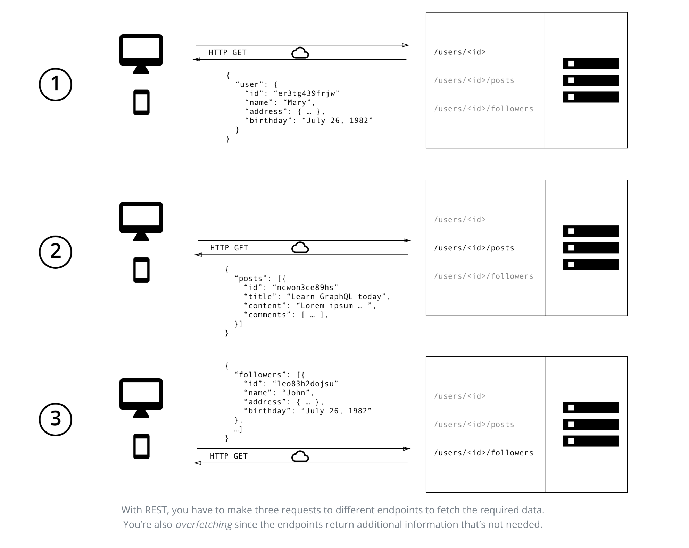

> * 原文地址：[GraphQL is the better REST](https://www.howtographql.com/basics/1-graphql-is-the-better-rest/)
> * 译文来自：[Github:EmilyQiRabbit](https://github.com/EmilyQiRabbit/GraphQLTranslation)
> * 译者：[旺财](https://github.com/EmilyQiRabbit)
> * **Froofreading is welcomed** 🙋 🎉

# GraphQL 是更好的 REST

在过去的十几年中，REST 是设计开发 web API 的标准。它确实提供了很多非常棒的思想：比如**无状态服务**，还有**结构化的资源访问**。But，现在客户端对数据的需求变化迅速，那么 REST API 就显得太过不灵活了。

GraphQL 就被设计出来，来满足这种对于灵活性和高效率的需求！它解决了很多开发者和 REST API 交互的时候的所要面临的缺点和低效的问题。

为了说清楚 REST 和 GraphQL 在从 API 获取数据时候的主要区别，让我们假设这样一个情境：在一个博客应用中，需要展示特定作者的博客的标题。同时，还要显示这个用户最近的三个 follower 的名字。REST 和 GraphQL 都是如何解决这个问题的呢？

> 看看[这篇文章](https://blog.graph.cool/b60cfa683511)，你就知道为什么开发者喜欢 GraphQL 了。

## 分别使用 REST 和 GraphQL 获取数据

使用 REST API，通常会通过访问多个端点来收集数据。在这个例子中，也就是访问 `/users/<id>` 来获取初始用户信息。然后访问类似 `/users/<id>/posts` 这样的接口来获取用户所有的博客信息。第三，访问 `/users/<id>/followers` 接口，将会返回用户所有的 follower。

如果使用的是 GraphQL 呢，那么你只需要向 GraphQL 服务发送一个请求，这个请求就包含了具体的数据需求。然后服务就会返回一个 JSON 对象，满足所有刚才客户端发送的数据请求。

## 再也不用担心过度/欠奉的数据获取

REST 最大的通病就是可能会过度/欠奉的获取数据。这是由于，客户端能够获取数据的唯一方法是访问只能返回固定数据结构的接口。REST 很难设计一个能够提供给所有的客户端恰好是他们需要的数据的 API。

> “使用图的思路，而不是端口的思路。” -- Lee Byron，GraphQL 的合作发明者。

### 过度获取：加载冗余数据

过度获取意味着客户端加载了比真实需要还要多的数据。例如，屏幕上仅需要显示用户的名字，但是如果使用 REST API，客户端只能访问 `/users` 接口然后接受返回的用户数据。接口的应答可能包括了用户更多的信息，比如生日或者住址 - 这些对客户端其实并没有什么用，人家其实只需要用户的名字。

### 欠奉获取和 n+1 问题

另一个问题是欠奉获取和 n+1 请求问题。欠奉获取通常意味着特定的接口无法提供足够的信息。客户端只有发起更多的请求来获取它需要的一切。这个情况可能升级为：客户端需要下载一个元素列表，然后还需要发起更多的请求来获取每个元素的数据。

例如，假设某个应用需要显示每个用户最新的三个 follower。API 提供了接口 `/users/<user-id>/followers`。那么为了能够显示所有需要的信息，app 需要首先对 `/users` 发起请求，然后再请求 `/users/<user-id>/followers` 来获取每个用户的 follower 信息。

## 前端产品的快速迭代

REST API 的一般模式是根据应用的界面来构建后台的接口。这样会很方便，客户端在某个页面直接发起对应的接口请求就可以获取到所有需要的信息了。

这个方法的缺点就是它不兼容前端的快速迭代。UI 的每次更改都很有可能同时改变数据的需求。导致的结果就是，后段也需要作出相应的调整来满足前端新的需要。这太没效率了，也就显着降低了通过用户反馈改善产品的能力。

有了 GraphQL 这些就都不是事儿。GraphQL天生就很灵活，客户端需求的改变不需要服务端做任何修改。因为客户端可以根据迭代要求自己定义数据格式，而后端工程师完全不需要对此作出任何调整。

## 深度分析后端

GraphQL 能够让你对请求的数据有精精准的把控。因为每个客户端都会指定特定的它们感兴趣的信息，那么深度了解这些被获取的数据是如何被使用的也就成为可能。这能帮助某些 API 的升级，并且如果某些数据从没有被客户端请求过，它就可以删掉。

GraphQL 更能帮助你做请求的的低级别性能监控。GraphQL 使用 resolver 函数的概念来收集客户端请求的数据。分析和测量这些 resolvers 的性能能够提供给你有关系统瓶颈的重要信息。

## Schema & Type System 的优势

GraphQL 使用强类型系统来定义 API 功能。API 暴露的类型都用 GraphQL Schema Definition Language 定义在一个 schema 里。这个 schema 作为服务端和客户端之间的协议，定义了客户端能够如何获取数据。

一旦定义了 schema，前端团队和后端团队就可以开始并行开发了，甚至不需要更多的沟通。因为他们都已经很清楚通过网络传送的数据结构了。

前端团队通过模拟（mocking）需要的数据就可以轻松的测试应用。而一旦服务端也准备好，前端团队就可以从真正的后端接口获取数据了。