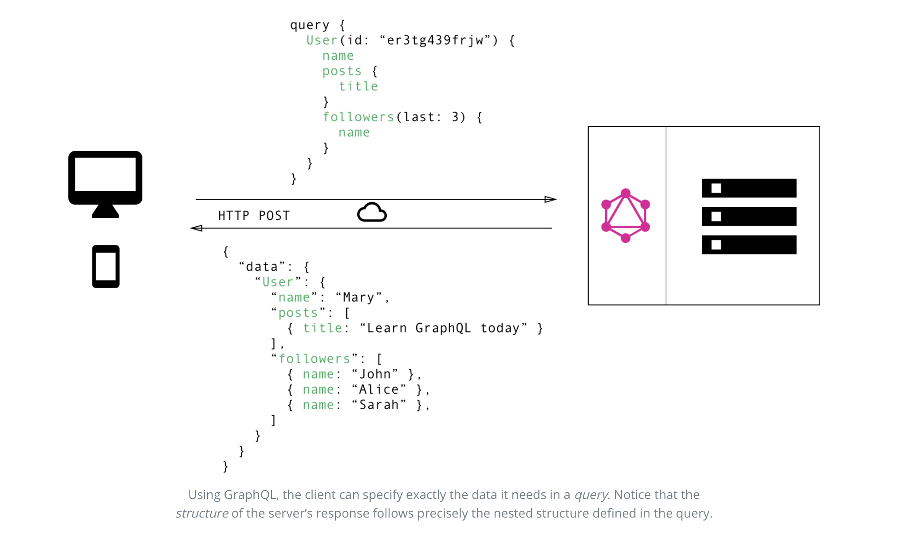

> * 原文地址：[Basics Tutorial - Introduction](https://www.howtographql.com/basics/0-introduction/)
> * 译文来自：[Github:EmilyQiRabbit](https://github.com/EmilyQiRabbit/GraphQLTranslation)
> * 译者：[旺财](https://github.com/EmilyQiRabbit)
> * **Froofreading is welcomed** 🙋 🎉

# GraphQL 是更好的 REST

在过去的十几年中，REST 是设计开发 web API 的标准。它确实提供了很多非常棒的思想：比如**无状态服务**，还有**结构化的资源访问**。But，现在客户端对数据的需求变化迅速，那么 REST API 就显得太过不灵活了。

GraphQL 就被设计出来，来满足这种对于灵活性和高效率的需求！它解决了很多开发者和 REST API 交互的时候的所要面临的缺点和低效的问题。

为了说清楚 REST 和 GraphQL 在从 API 获取数据时候的主要区别，让我们假设这样一个情境：在一个博客应用中，需要展示特定作者的博客的标题。同时，还要显示这个用户最近的三个 follower 的名字。REST 和 GraphQL 都是如何解决这个问题的呢？

> 看看[这篇文章](https://blog.graph.cool/b60cfa683511)，你就知道为什么开发者喜欢 GraphQL 了。

## 使用 REST 和 GraphQL 获取数据

使用 REST API，通常会通过访问多个端点来收集数据。在这个例子中，也就是访问 `/users/<id>` 来获取初始用户信息。然后访问类似 `/users/<id>/posts` 这样的接口来获取用户所有的博客信息。第三，访问 `/users/<id>/followers` 接口，将会返回用户所有的 follower。

如果使用的是 GraphQL 呢，那么你只需要向 GraphQL 服务发送一个请求，这个请求就包含了具体的数据需求。然后服务就会返回一个 JSON 对象，满足所有刚才客户端发送的数据请求。

## 再也不用担心过度/欠奉的数据获取

REST 最大的通病就是可能会过度/欠奉的获取数据。这是由于，客户端能够获取数据的唯一方法是访问只能返回固定数据结构的接口。REST 很难设计一个能够提供给所有的客户端恰好是他们需要的数据的 API。

> “使用图的思路，而不是端口的思路。” -- Lee Byron，GraphQL 的合作发明者。

### 过度获取：加载冗余数据

(待续)