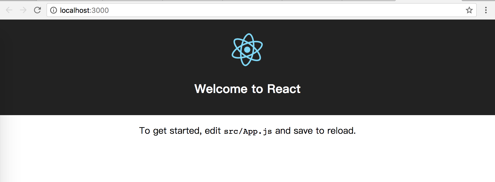

> * 原文地址：[Getting Started](https://www.howtographql.com/react-apollo/1-getting-started/)
> * 译文来自：[Github:EmilyQiRabbit](https://github.com/EmilyQiRabbit/GraphQLTranslation)
> * 译者：[Yuqi🌸](https://github.com/EmilyQiRabbit)
> * **欢迎校对** 🙋‍♀️🎉

# 开始吧～

这部分的重点是前端，所以我们就不在后端服务的实现上花费时间了。直接使用 [Node 教程](https://www.howtographql.com/graphql-js/0-introduction)提供服务。

一旦搭建好了 React 应用，你可以直接获得后端所需的代码。

> 提示：本教程最终的工程代码可以在 [Github](https://github.com/howtographql/react-apollo) 上找到。如果你在学习过程中感到困惑，随时可以参考它。并且每个代码块前面都有文件名，可以直接链接到 github 上对应的文件里，所以你能清楚的知道当前代码应该处于什么位置以及最终完成的时候它应该是什么样子。

## 前端部分

### 创建应用

首先，创建一个 React 项目。我们使用 create-react-app 来完成这个任务。

首先需要使用 npm 安装 create-react-app。

```sh
yarn global add create-react-app
```

> 本教程使用 [yarn](https://yarnpkg.com/zh-Hans/) 作为依赖管理。[这里是安装教程](https://yarnpkg.com/en/docs/install#mac-stable)。如果你用的是 npm，运行对应同样功能的命令即可。

然后，就可以用 create-react-app 构建 React 应用了：

```sh
create-react-app hackernews-react-apollo
```

这行命令将会创建一个新的目录：hackernews-react-apollo，包含 app 基础的设置，你可以进入这个目录然后执行 start 命令来运行这个 app：

```sh
cd hackernews-react-apollo
yarn start
```

这个操作将会打开浏览器并导航至 http://localhost:3000，也就是应用运行的地址和端口。如果一切顺利，你将会看到：



为了优化项目的结构，在 src 文件中创建两个新的目录，文件 components 包含所有的 React 组件，文件 styles 则包含所有的样式代码。

整理一下已有文件，把 App.js 放到 components 中，把 App.css，index.css 放到 styles 里。同时别忘了调整 index.js 中 import 语句的引用地址：

```js
import React from 'react'
import ReactDOM from 'react-dom'
import './styles/index.css'
import App from './components/App'
```

你的文件目录现在应该长这样：

```
.
├── README.md
├── node_modules
├── package.json
├── public
│   ├── favicon.ico
│   ├── index.html
│   └── manifest.json
├── src
│   ├── App.test.js
│   ├── components
│   │   └── App.js
│   ├── index.js
│   ├── logo.svg
│   ├── registerServiceWorker.js
│   └── styles
│       ├── App.css
│       └── index.css
└── yarn.lock
```

### 样式

本篇的主要目的是在 React 中使用 GraphQL，所以关于样式，我们就简略的说一下。为了减少项目中的 css 代码，我们使用 [Tachyons](http://tachyons.io) 库，它提供了很多 css 类。

打开 public/index.html 然后添加一个 link 标签引入 Tachyons：

```html
<link rel="manifest" href="%PUBLIC_URL%/manifest.json">
<link rel="shortcut icon" href="%PUBLIC_URL%/favicon.ico">
<link rel="stylesheet" href="https://unpkg.com/tachyons@4.2.1/css/tachyons.min.css"/>
```

然后在 index.css 文件里再添加一些项目中需要用到的其他样式：

```css
body {
  margin: 0;
  padding: 0;
  font-family: Verdana, Geneva, sans-serif;
}

input {
  max-width: 500px;
}

.gray {
  color: #828282;
}

.orange {
  background-color: #ff6600;
}

.background-gray {
  background-color: rgb(246,246,239);
}

.f11 {
  font-size: 11px;
}

.w85 {
  width: 85%;
}

.button {
  font-family: monospace;
  font-size: 10pt;
  color: black;
  background-color: buttonface;
  text-align: center;
  padding: 2px 6px 3px;
  border-width: 2px;
  border-style: outset;
  border-color: buttonface;
  cursor: pointer;
  max-width: 250px;
}
```

### 安装 Apollo 客户端

下一步，装载 Apollo 客户端和绑定 React 的包，在命令行执行：

```
yarn add apollo-boost react-apollo graphql
```

我们来简单了解下这几个安装包：

* apollo-boost 打包了一些构建 Apollo 客户端所需要的库：
  * apollo-client
  * apollo-cache-inmemory
  * apollo-link-http
  * apollo-link-error
  * apollo-link-state
  * graphql-tag

* react-apollo 包含了 Apollo 配合 React 使用时需要的一些绑定

* graphql 包含了 Facebook 对 GraphQL 的实现，Apollo 客户端也需要用到这里的部分功能。

现在我们可以开始写代码了！

### 配置 ApolloClient

Apollo 将那些底层的网络逻辑隐藏起来，为 GraphQL 服务提供了一个干净利落的接口。相比于使用 REST API，你不需要构建 HTTP 请求了 - 你只需要写好 query 和 mutation，然后用 ApolloClient 的实例发送就可以！🎉

首先你需要对 ApolloClient 进行配置。它需要知道 GraphQL API 的端口，以便于建立网络连接。

打开 src/index.js，写入如下代码：

```JavaScript
import React from 'react'
import ReactDOM from 'react-dom'
import './styles/index.css'
import App from './components/App'
import registerServiceWorker from './registerServiceWorker'
// 1
import { ApolloProvider } from 'react-apollo'
import { ApolloClient } from 'apollo-client'
import { HttpLink } from 'apollo-link-http'
import { InMemoryCache } from 'apollo-cache-inmemory'

// 2
const httpLink = new HttpLink({ uri: 'http://localhost:4000' })

// 3
const client = new ApolloClient({
  link: httpLink,
  cache: new InMemoryCache()
})

// 4
ReactDOM.render(
  <ApolloProvider client={client}>
    <App />
  </ApolloProvider>
  , document.getElementById('root')
)
registerServiceWorker()
```

> 注意：使用 create-react-app 生成的项目用了分号并且使用的双引号。而现在刚加入的代码则没有使用分号，并且使用了单引号。鼓励分号都删掉，并且尽量使用单引号。🔥

我们来解释下这段代码：

1. 引包

2. 创建 HttpLink，将 ApolloClient 实例和 GraphQL API 连接。你的 GraphQL 服务应当运行在 http://localhost:4000。

3. 实例化 ApolloClient，需要传入 httpLink 和 InMemoryCache 实例。

4. 渲染 React app 的 root 组件。该组件需要被高阶组件 ApolloProvider 包裹，这就将 client 作为一个 prop 传入了子组件。

好了，现在开始向 app 中传入一些数据吧。

## 后端

### 下载服务端代码

**后端的内容会在 Node 部分详述，这里就简写了。详细的内容可以参考原文**

就像前面说的，直接用 [Node 教程](https://www.howtographql.com/graphql-js/0-introduction) 提供的项目代码。

在 hackernews-react-apollo 目录下运行：

```sh
curl https://codeload.github.com/howtographql/react-apollo/tar.gz/starter | tar -xz --strip=1 react-apollo-starter/server
```

>如果你使用的是 windows，你需要安装 [Git CLI](https://git-scm.com) 来避免类似 curl 这样的命令可能有的坑。

现在在文件中可以看到一个新的 server 文件，这里面包含了所有你需要的后端代码。

代码的解释这里就不详述了，就将安装过程写一下，后面的 Node 教程会对这里进行详细解说。

### 部署 Prisma 数据库服务

**后端的内容会在 Node 部分详述，这里就简写了。详细的内容可以参考原文**

这是可以开启服务的最后一步了：部署数据库。

具体的方式就是，安装依赖然后激活部署。在控制台，首先进入 server 文件目录下，然后执行：

```
yarn install
yarn prisma deploy
```

> 当执行 yarn prisma deploy 的时候，随便选择一个开发 cluster 就可以，public-us1 或者 public-eu1 均可。

执行成功后，在打印的日志里面将 HTTP 端口信息粘贴到 server/src/index.js 文件里，替换掉 `__PRISMA_ENDPOINT__`：

```js
const server = new GraphQLServer({
  typeDefs: './src/schema.graphql',
  resolvers,
  context: req => ({
    ...req,
    db: new Prisma({
      typeDefs: 'src/generated/prisma.graphql',
      endpoint: '__PRISMA_ENDPOINT__',
      secret: 'mysecret123',
    }),
  }),
})
```

> 如果日志丢失，可以执行：

```
yarn prisma info
```

### “探索”服务

现在你可以开始试着探索你的服务了。在 server 目录下，执行如下命令来启动服务

```
yarn dev
```

这行命令将会自行 package.json 文件中 script dev 对应的命令。它首先会启动服务，然后将会打开一个 GraphQL Playground，你可以用它来探索 API。如果你只想启动服务，不想打开 GraphQL Playground，那么运行 yarn start 即可。

如果启动报错，请更新你的 node 版本。

如果你打开了 playground，你就可以试着输入一些代码来测试了，参照[原文](https://www.howtographql.com/react-apollo/1-getting-started/)的栗子很简单～如果有兴趣的可以去看看，这里不赘述。

[self Proofreading +1]