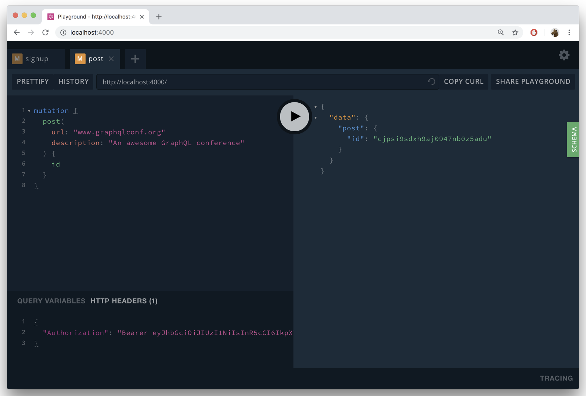

> * 原文地址：[Getting Started](https://www.howtographql.com/react-apollo/1-getting-started/)
> * 译文来自：[Github:EmilyQiRabbit](https://github.com/EmilyQiRabbit/GraphQLTranslation)
> * 译者：[Yuqi🌸](https://github.com/EmilyQiRabbit)
> * **欢迎校对** 🙋‍♀️🎉

# React - Apollo 入门教程

由于这部分是前端教程，所以我们就不在后端服务的实现上花费时间讲解了。我们直接使用 [Node 教程](https://www.howtographql.com/graphql-js/0-introduction)中的代码所提供服务。

这样当你创建了 React 应用，就可以直接拉取后端所需的代码。

> 提示：本教程的最终项目代码可以在 [Github](https://github.com/howtographql/react-apollo) 上找到。如果你在接下来章节的学习过程中遇到了困惑，那么随时可以参考它。同时提醒大家，每个代码块前面都标注有文件名，它直接链接到 GitHub 上对应的文件里，这样你就能清楚的知道当前代码应该处于什么位置，以及最终完成的时候它应该是什么样子。

## 前端部分

### 创建应用

首先我们创建一个 React 项目。我们使用 create-react-app 命令来完成这个任务。

当然你需要首先使用 yarn 来安装 create-react-app：

```shell
yarn global add create-react-app
```

> 注：本教程使用 [Yarn](https://yarnpkg.com/lang/en/) 来做依赖管理。你可以在 [这里](https://yarnpkg.com/en/docs/install#mac-stable) 找到安装 Yarn 的说明。如果你更喜欢使用 npm，只需运行和教程中等价的 npm 命令即可。

接下来，就可以使用它来构建你的 React 应用了：

```shell
create-react-app hackernews-react-apollo
```

这个命令会为你创建一个名为 `hackernews-react-apollo` 的目录，在这个目录下，所有基本的设置都已配置好了。

一切完成后，就可以像如下这样可以进入目录并启动项目：

```sh
cd hackernews-react-apollo
yarn start
```

这将会打开浏览器并导航至 http://localhost:3000，我们的应用就运行在这个端口。如果一切顺利，你将会看到：


为了让项目的结构更加合理，我们在 src 文件中再创建两个子目录。一个名为 components，用来保存所有 React 组件。另一个是 styles，用来保存所有的 CSS 文件。

App.js 本身就是一个组件，所以我们把它放入 components 文件中。App.css 和 index.css 都是样式文件，所以把它们放入 styles 文件中。然后我们还需要修改对这些文件的引用：

```js
import React from 'react'
import ReactDOM from 'react-dom'
import './styles/index.css'
import App from './components/App'
```

```js
import React, { Component } from 'react';
import logo from '../logo.svg';
import '../styles/App.css';
```

你的文件目录现在应该是这样子的：

```
.
├── README.md
├── node_modules
├── package.json
├── public
│   ├── favicon.ico
│   ├── index.html
│   └── manifest.json
├── src
│   ├── App.test.js
│   ├── components
│   │   └── App.js
│   ├── index.js
│   ├── logo.svg
│   ├── registerServiceWorker.js
│   └── styles
│       ├── App.css
│       └── index.css
└── yarn.lock
```

### 样式

本篇文章的重点在于 GraphQL 的概念以及如何在 React 应用中使用 GraphQL，所以样式问题我们就简略带过，不会花费很多时间。为了减少项目中的 CSS 代码，我们使用 [Tachyons](http://tachyons.io) 库，它提供了很多现成的 CSS 类。

打开 public/index.html 然后添加一个 link 标签引入 Tachyons：

```html
<link rel="manifest" href="%PUBLIC_URL%/manifest.json">
<link rel="shortcut icon" href="%PUBLIC_URL%/favicon.ico">
<link rel="stylesheet" href="https://unpkg.com/tachyons@4.2.1/css/tachyons.min.css"/>
```

但在项目中你依旧需要一些自定义样式，所以我们也为你准备了一些可能需要的其他样式：

打开 index.css 文件，添加如下代码：

```css
body {
  margin: 0;
  padding: 0;
  font-family: Verdana, Geneva, sans-serif;
}

input {
  max-width: 500px;
}

.gray {
  color: #828282;
}

.orange {
  background-color: #ff6600;
}

.background-gray {
  background-color: rgb(246,246,239);
}

.f11 {
  font-size: 11px;
}

.w85 {
  width: 85%;
}

.button {
  font-family: monospace;
  font-size: 10pt;
  color: black;
  background-color: buttonface;
  text-align: center;
  padding: 2px 6px 3px;
  border-width: 2px;
  border-style: outset;
  border-color: buttonface;
  cursor: pointer;
  max-width: 250px;
}
```

### 安装 Apollo 客户端

下一步我们要安装 Apollo 客户端（以及和 React 的绑定），这需要我们安装多个包，在命令行执行：

```shell
yarn add apollo-boost react-apollo graphql
```

我们来简单了解下这几个已经安装的包：

* [apollo-boost](https://github.com/apollographql/apollo-client/tree/master/packages/apollo-boost) 通过将 Apollo 客户端需要的几个安装包结合起来，从而为开发者提供了一些便利：
  * apollo-client：All the magic happens here ✨
  * apollo-cache-inmemory：推荐用来缓存的包
  * apollo-link-http：用于获取服务端数据
  * apollo-link-error：处理错误
  * apollo-link-state：状态管理
  * graphql-tag：用于 queriy 和 mutation 的 gql 方法

* [react-apollo](https://github.com/apollographql/react-apollo) 包含了 Apollo 与 React 的绑定功能

* [graphql](https://github.com/graphql/graphql-js) 包含了 Facebook 对 GraphQL 的实现，Apollo 客户端也需要用到它的部分功能。

好了，现在我们可以开始写代码了！🚀

### 配置 ApolloClient

Apollo 将底层的网络逻辑抽象隐藏了，并为 GraphQL 服务提供了易于对接的接口。相比于使用 REST API，你不需要构建 HTTP 请求了 - 你只需要写好 query 和 mutation，然后用 ApolloClient 实例发送即可。

首先你需要完成 ApolloClient 实例的配置。它需要知道 GraphQL API 的端口，以便于建立网络连接。

打开 src/index.js，写入如下代码：

```JavaScript
import React from 'react'
import ReactDOM from 'react-dom'
import './styles/index.css'
import App from './components/App'
import * as serviceWorker from './serviceWorker';

// 1
import { ApolloProvider } from 'react-apollo'
import { ApolloClient } from 'apollo-client'
import { createHttpLink } from 'apollo-link-http'
import { InMemoryCache } from 'apollo-cache-inmemory'


// 2
const httpLink = createHttpLink({
  uri: 'http://localhost:4000'
})

// 3
const client = new ApolloClient({
  link: httpLink,
  cache: new InMemoryCache()
})

// 4
ReactDOM.render(
  <ApolloProvider client={client}>
    <App />
  </ApolloProvider>,
  document.getElementById('root')
)
serviceWorker.unregister();
```

> 注：使用 create-react-app 生成的项目代码使用了分号，并且使用双引号表示字符串。而上文的代码则没有使用分号，并且使用单引号表示字符串。你可以按照你的习惯，将代码中的分号删除，并将双引号替换为单引号。🔥

我们来解释下这段代码：

1. 从已经安装的包中引入需要的依赖

2. 创建 HttpLink，它会将 ApolloClient 实例和 GraphQL API 连接起来。你的 GraphQL 服务应当运行在 http://localhost:4000。

3. 通过传入 httpLink 和 InMemoryCache 实例，实例化 ApolloClient。

4. 渲染 React 应用的 root 组件。该组件需要被高阶组件 ApolloProvider 包裹，并将 ApolloClient 的实例作为 client 属性传入。

好了，一切配置完毕，现在开始向应用中传入一些数据吧！😎

## 后端

### 下载服务端代码

就像前面说的，后端部分，我们就直接用 [Node 教程](https://www.howtographql.com/graphql-js/0-introduction) 提供的项目代码。

在 hackernews-react-apollo 目录下运行：

```sh
curl https://codeload.github.com/howtographql/react-apollo/tar.gz/starter | tar -xz --strip=1 react-apollo-starter/server
```

> 如果你使用的是 Windows 系统，你需要安装 [Git CLI](https://git-scm.com) 来避免 curl 命令可能有的坑。

现在在文件中可以看到一个新的 server 目录，这里面包含了所有你需要的后端代码。

在启动服务前，我们快速了解一下后端服务中主要的组件：

* prisma：这个目录保存了与 [Prisma](https://www.prisma.io) 配置有关的文件。在 GraphQL resolver 中，Prisma 客户端用来和数据库交互（和 ORM，即“对象关系映射”类似）。
  * prisma.yml 是 Prisma 项目的根配置文件。
  * datamodel.prisma 定义了 GraphQL 模式定义语言（即 SDL）中的数据模型。当你使用 Prisma 的时候，数据模型可以用来描述数据库中的模式。
* src：这个目录保存了 GraphQL 服务的文件。
  * schema.graphql 包括了你的应用模式。应用模式定义了你可以在前端发送的 GraphQL 操作。稍后我们会深入分析这个文件。
  * generated/prisma-client 包含了自动生成的 Prisma 客户端，是一个类型安全的数据库访问库（类似于 ORM）。
  * resolvers 包含了定义在应用模式里的 resolver 函数，用于解析 GraphQL 操作。
  * index.js 是 GraphQL 服务的入口。

在上面提到的这些文件中，前端研发者只需要关心定义在 server/src/schema.graphql 里的应用模式。这个文件里包含了 GraphQL 模式，它定义了所有能从前端应用发送的操作（即 queriy，mutation 和 subscription）。

这个文件中的代码如下：

```graphql
# import Link, Vote, LinkSubscriptionPayload, VoteSubscriptionPayload from "./generated/prisma.graphql"

type Query {
  feed(filter: String, skip: Int, first: Int, orderBy: LinkOrderByInput): Feed!
}

type Feed {
  links: [Link!]!
  count: Int!
}

type Mutation {
  post(url: String!, description: String!): Link!
  signup(email: String!, password: String!, name: String!): AuthPayload
  login(email: String!, password: String!): AuthPayload
  vote(linkId: ID!): Vote
}

type AuthPayload {
  token: String
  user: User
}

type User {
  id: ID!
  name: String!
  email: String!
}

type Subscription {
  newLink: LinkSubscriptionPayload
  newVote: VoteSubscriptionPayload
}
```

该模式支持如下的操作：

* Queriy：
  * feed：从后端取回所有的新闻链接，同时支持过滤参数、排序和分页。

* Mutation：
  * post：登录了的用户可以创建新的新闻链接
  * signup：为新用户创建账号
  * login：已注册用户登录
  * vote：支持以登录的用户为喜欢的新闻链接点赞/帮顶

* Subscription
  * newLink：在新建新闻链接后实时更新列表
  * newVote：在用户点赞/帮顶后实时更新列表

例如，你可以发送如下的 feed query 来从服务端获取最近的 10 条信息：

```graphql
{
  feed(skip: 0, first: 10) {
    links {
      description
      url
      postedBy {
        name
      }
    }
  }
}
```

或者可以是用来创建新用户的 signup mutation

```graphql
mutation {
  signup(
    name: "Sarah",
    email: "sarah@graph.cool",
    password: "graphql"
  ) {
    token
    user {
      id
    }
  }
}
```

### 部署 Prisma 数据库服务

这是启动服务前的最后一步了：部署 Prisma 项目，这样 GraphQL 服务端才可以访问它获取数据。

部署 Prisma 你所要做的就是：安装依赖然后在 server 目录下执行 prisma deploy 命令。

在控制台，进入 server 目录下，然后执行：

```
cd server
yarn install
yarn prisma deploy
```

注：如果你已经全局安装了 prisma CLI（如需全局安装，执行 yarn global add prisma 即可），你就可以省略 yarn prisma 命令。这时，直接执行 prisma deploy 即可。

安装过程中，当需要你选择在哪里配置/部署服务的时候，选择 Demo server（需要登录，你可以使用 Github 账号），然后选择一个区域（region），例如 demo-us1 或者 demo-eu1。此时 Demo server 会包含一个免费的 AWS Aurora 数据库实例。（如果你已经安装了 Docker，你也可以在本地部署。）

> 注：一旦命令执行完毕，CLI 将会把 Prisma API 的端口写入你的 prisma.yml 文件。它大概会是这样子：https://eu1.prisma.sh/john-doe/hackernews-node/dev。

### “探索”服务

Prisma 端口填写完成后，现在你可以开始试着探索你的服务了！

在 server 目录下，执行如下命令来启动服务：

```
yarn start
```

这行命令将会运行 package.json 文件中 script start 对应的命令。它首先会启动服务（服务将会运行在：http://localhost:4000），然后将会自动打开 [GraphQL 练习场](https://github.com/graphcool/graphql-playground)界面，你可以用它来探索 API。



...

> 如果你已经打开了 GraphQL 练习场，就可以试着输入一些代码来测试 API 了，参照[原文](https://www.howtographql.com/react-apollo/1-getting-started/)的栗子很简单～如果有兴趣的可以去看看，这里不赘述。
