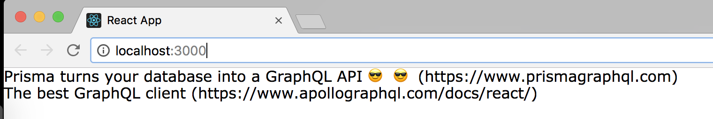

> * 原文地址：[Queries: Loading Links](https://www.howtographql.com/react-apollo/2-queries-loading-links/)
> * 译文来自：[Github:EmilyQiRabbit](https://github.com/EmilyQiRabbit/GraphQLTranslation)
> * 译者：[Yuqi🌸](https://github.com/EmilyQiRabbit)
> * **欢迎校对** 🙋‍♀️🎉

# 使用 query 加载新闻链接数据

## 准备 React 组件

这个应用需要实现的第一个功能是加载并显示一个由 Link 元素组成的列表。我们将沿着 React 组件的层级结构逐步前进，并从渲染单个新闻链接的组件开始。

在 components 目录下创建一个新的文件：Link.js，然后添加如下的代码：

```JavaScript
import React, { Component } from 'react'

class Link extends Component {
  render() {
    return (
      <div>
        <div>
          {this.props.link.description} ({this.props.link.url})
        </div>
      </div>
    )
  }
}

export default Link
```

这是个非常简单的 React 组件，其属性（this.props）中包含了 link 属性，将会渲染出该 link 的 description 和 url 信息。非常容易吧 🍰！

然后在 components 目录下再创建一个新的文件：LinkList.js，并添加如下代码：

```js
import React, { Component } from 'react'
import Link from './Link'

class LinkList extends Component {
  render() {
    const linksToRender = [
      {
        id: '1',
        description: 'Prisma turns your database into a GraphQL API 😎',
        url: 'https://www.prismagraphql.com',
      },
      {
        id: '2',
        description: 'The best GraphQL client',
        url: 'https://www.apollographql.com/docs/react/',
      },
    ]

    return (
      <div>{linksToRender.map(link => <Link key={link.id} link={link} />)}</div>
    )
  }
}

export default LinkList
```

这里用了本地保存的模拟数据来检验 Link 组件是否运作正常。稍后我们将会学习如何从后台服务获取这些数据 —— 要一步步来，young Padawan！

最后，修改 App.js 文件：

```JavaScript
import React, { Component } from 'react'
import LinkList from './LinkList'

class App extends Component {
  render() {
    return <LinkList />
  }
}

export default App
```

下面我们运行 app，如果一切正常的话，在浏览器应该能看到：



## 第一个 GraphQL query 请求

下面你将要从数据库加载已保存的新闻链接信息，而不是使用本地的模拟数据。首先你要定义发送给 API 的 GraphQL query：

```graphql
{
  feed {
    links {
      id
      createdAt
      description
      url
    }
  }
}
```

你在[练习场](https://www.prisma.io/docs/get-started/03-build-graphql-servers-with-prisma-TYPESCRIPT-t201/#explore-the-graphql-api-in-a-playground)里直接执行这段代码，就可以从 GraphQL 服务得到请求的结果。但是如何在 JS 代码中使用它呢？

## 使用 Apollo 客户端发送 query

如果使用了 Apollo，那么你有两种向服务端发送 query 请求的方式。

第一种是在 ApolloClient 实例上直接调用 query 方法。这是种方式方式简单直接，并可以以 promise 的方式取到结果。

例如：

```js
client.query({
  query: gql`
    {
      feed {
        links {
          id
        }
      }
    }
  `
}).then(response => console.log(response.data.allLinks))
```

然而，由于是和 React 一起使用，我们应该选择更具声明性的方法：使用 Apollo 的 [render prop API](https://dev-blog.apollodata.com/introducing-react-apollo-2-1-c837cc23d926)，这样我们只需使用组件即可管理 GraphQL 数据。

如果使用这个方法，你要做的就是：在需要获取数据的时候，将 GraphQL query 作为属性传递给 `<Query />` 组件，它将会帮助你获取数据；当数据取回后，将以组件 [render prop 函数](https://reactjs.org/docs/render-props.html) 的方式提供给开发者。

因此，每次添加获取数据逻辑的代码的步骤都很类似：

1. 使用 gql 把 query 赋值给一个 JS 常量

2. 将 FEED_QUERY 常量作为 query 属性传递给 `<Query />` 组件

3. 在组件内部的 render prop 函数中获取请求结果

我们来改写 [LinkList.js](https://github.com/howtographql/react-apollo/blob/master/src/components/LinkList.js)：

```js
const FEED_QUERY = gql`
  {
    feed {
      links {
        id
        createdAt
        url
        description
      }
    }
  }
`
// 并将返回值替换为：
return (
  <Query query={FEED_QUERY}>
    {() => linksToRender.map(link => <Link key={link.id} link={link} />)}
  </Query>
)
```

这段代码是什么意思呢：

1. 常量 FEED_QUERY 包含了这个 query 的信息。gql 函数用来解析这个包含了 GraphQL 代码的字符串。(如果你不熟悉 '``' 这种语法，可以[参考这里](https://wesbos.com/tagged-template-literals/))

2. 最后，将函数原来的返回值用 `<Query />` 组件包裹，并将 FEED_QUERY 作为属性传递进去。

为了让这段代码能够正常工作，还需要引入相关的依赖：

```JavaScript
import { Query } from 'react-apollo'
import gql from 'graphql-tag'
```

这就是可以获取到数据的代码了，是不是很棒？但是我们现在还在渲染的是本地模拟的数据，而不是从服务端获取的数据。下面我们来再改一下代码 🤩。

我们现在可以删除掉那些本地的模拟数据了，通过 `<Query />` 组件的 render prop 函数，数据已经可以从服务端获取。

更新 LinkList.js：

```JavaScript
class LinkList extends Component {
  render() {
    return (
      <Query query={FEED_QUERY}>
        {({ loading, error, data }) => {
          if (loading) return <div>Fetching</div>
          if (error) return <div>Error</div>
    
          const linksToRender = data.feed.links
    
          return (
            <div>
              {linksToRender.map(link => <Link key={link.id} link={link} />)}
            </div>
          )
        }}
      </Query>
    )
  }
}
```

让我们来分析下这段代码到底做了什么？正如我们所预期的那样，Apollo 给组件的 render prop 函数提供了几个新的参数，这些参数提供了网络请求相关的信息：

1. loading：当网络请求还依旧进行、没有收到应答的时候，这个值是 true。

2. error：如果请求失败，这个字段就会包含错误信息。

3. data：包含了从服务器获取到的数据。在这里就是我们请求的那些新闻链接的信息。

> 实际上，这些参数还能提供更多功能，如果你想了解更多，可以查看[文档](https://www.apollographql.com/docs/tutorial/queries/)。

完成了，现在再次运行 yarn start 来试试看。你将会看到真实的从服务端返回的数据了。（别忘了在 server 目录下也需要 yarn start 哦！）
