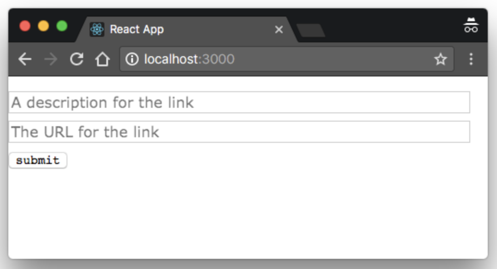

> * 原文地址：[Mutations: Creating Links](https://www.howtographql.com/react-apollo/3-mutations-creating-links/)
> * 译文来自：[Github:EmilyQiRabbit](https://github.com/EmilyQiRabbit/GraphQLTranslation)
> * 译者：[Yuqi🌸](https://github.com/EmilyQiRabbit)
> * **欢迎校对** 🙋‍♀️🎉

# 使用 Mutation 创建新的新闻链接

这一章我们将会学习如何使用 Apollo 发送 mutation（即：修改/新建/删除）请求。它与 query 请求的区别不大，同样也遵循三个步骤，只是后两步稍有区别：

1. 使用 gql 解析函数写一个表示 mutation 的 JavaScript 常量

2. 使用 `<Mutation />` 组件，并将 mutation 和作为 props 传递给组件

3. 使用 mutation 函数，这个函数可以在组件的 render prop 函数中获取到

## 准备 React 组件

首先需要准备一个能够让用户用添加新闻链接的 React 组件。

在 src/components 目录下创建一个新的文件 CreateLink.js。然后把下面的代码复制进去：

```js
import React, { Component } from 'react'

class CreateLink extends Component {
  state = {
    description: '',
    url: '',
  }

  render() {
    const { description, url } = this.state
    return (
      <div>
        <div className="flex flex-column mt3">
          <input
            className="mb2"
            value={description}
            onChange={e => this.setState({ description: e.target.value })}
            type="text"
            placeholder="A description for the link"
          />
          <input
            className="mb2"
            value={url}
            onChange={e => this.setState({ url: e.target.value })}
            type="text"
            placeholder="The URL for the link"
          />
        </div>
        <button onClick={`... you'll implement this 🔜`}>Submit</button>
      </div>
    )
  }
}

export default CreateLink
```

组件内包含了两个 input 输入框，用户可以用它们输入想要创建的新闻链接的地址信息 url 和描述信息 description。信息将会被保存在组件的 state 中，并将会在用户发起 mutation 请求的时候使用。

## 第一个 mutation 请求

到底应该如何将 mutation 请求发送至服务端呢。我们按照前文提到的三个步骤依次进行。

首先使用 JavaScript 代码定义 mutation，然后将组件用 graphql 容器包裹。这一步和 query 请求很类似。

在 CreateLing.js 中添加如下的代码：

```JavaScript
const POST_MUTATION = gql`
  mutation PostMutation($description: String!, $url: String!) {
    post(description: $description, url: $url) {
      id
      createdAt
      url
      description
    }
  }
`

// 替换 button 的代码

<Mutation mutation={POST_MUTATION} variables={{ description, url }}>
  {() => (
    <button onClick={`... you'll implement this soon`}>
      Submit
    </button>
  )}
</Mutation>
```

代码解析：

1. 常量 POST_MUTATION 内包含了 mutation 信息

2. 将 button 元素作为 render prop 函数的返回值，它被包裹在 `<Mutation />` 组件中，并需要将 POST_MUTATION 作为 prop 传递给 `<Mutation />` 组件

3. 最后，将 description 和 url 信息作为 variables prop 传递给 `<Mutation />` 组件

当然，别忘了添加依赖：

```js
import { Mutation } from 'react-apollo'
import gql from 'graphql-tag'
```

最后，修改 `<Mutation />` 组件：

```js
<Mutation mutation={POST_MUTATION} variables={{ description, url }}>
  {postMutation => <button onClick={postMutation}>Submit</button>}
</Mutation>
```

跟之前说的一样，你需要做的就是在按钮点击事件函数中，调用 Apollo 已经注入到 `<Mutation />` 组件的 render prop 函数中的 postMutation 方法。

[点击这里可以查看 CreateLink.js 源代码](https://github.com/howtographql/react-apollo/blob/master/src/components/CreateLink.js)

下面我们就可以验证 mutation 是否工作了，将 App.js 的 render 改成下面这样：

```js
render() {
  return (
    <CreateLink />
  )
}
```

当然记得在 App.js 中引用下 CreateLink：

```js
import CreateLink from './CreateLink'
```

现在，运行 yarn start，你应该会看到如下的界面，此时就可以发送 mutation 了。


