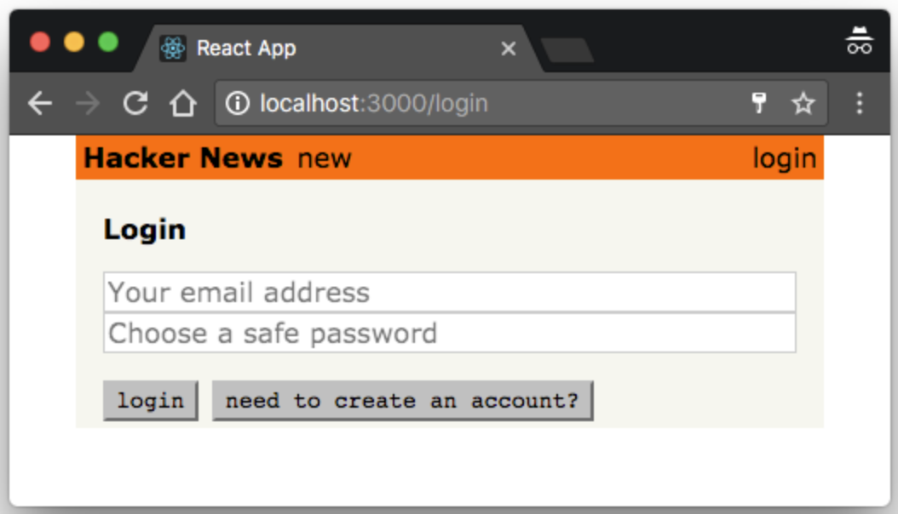
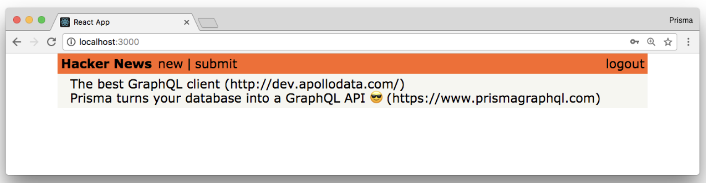

> * 原文地址：[Authentication](https://www.howtographql.com/react-apollo/5-authentication/)
> * 译文来自：[Github:EmilyQiRabbit](https://github.com/EmilyQiRabbit/GraphQLTranslation)
> * 译者：[Yuqi🌸](https://github.com/EmilyQiRabbit)
> * **欢迎校对** 🙋‍♀️🎉

# 认证

这一章我们将会学习如何使用 Apollo 进行认证，并为用户提供注册和登录的功能。

## 准备 React 组件

和之前一样，首先需要准备好登录功能需要的 React 组件，我们从构建 Login 组件开始：

在 components 目录下，创建 Login.js，然后粘贴如下代码：

```JavaScript
import React, { Component } from 'react'
import { AUTH_TOKEN } from '../constants'

class Login extends Component {
  state = {
    login: true, // 用来切换登录和注册功能
    email: '',
    password: '',
    name: '',
  }

  render() {
    const { login, email, password, name } = this.state
    return (
      <div>
        <h4 className="mv3">{login ? 'Login' : 'Sign Up'}</h4>
        <div className="flex flex-column">
          {!login && (
            <input
              value={name}
              onChange={e => this.setState({ name: e.target.value })}
              type="text"
              placeholder="Your name"
            />
          )}
          <input
            value={email}
            onChange={e => this.setState({ email: e.target.value })}
            type="text"
            placeholder="Your email address"
          />
          <input
            value={password}
            onChange={e => this.setState({ password: e.target.value })}
            type="password"
            placeholder="Choose a safe password"
          />
        </div>
        <div className="flex mt3">
          <div className="pointer mr2 button" onClick={() => this._confirm()}>
            {login ? 'login' : 'create account'}
          </div>
          <div
            className="pointer button"
            onClick={() => this.setState({ login: !login })}
          >
            {login
              ? 'need to create an account?'
              : 'already have an account?'}
          </div>
        </div>
      </div>
    )
  }

  _confirm = async () => {
    // ... 稍后我们再实现这部分代码
  }

  _saveUserData = token => {
    localStorage.setItem(AUTH_TOKEN, token)
  }
}

export default Login
```

我们先快速了解一下这个新组件的结构，它有两个状态：

* 第一个状态用于：**用户已有账号，只需要登录**。这时组件只渲染两个 input 输入框，用来让用户输入邮箱和密码信息。这时 state.login 的值是 true。

* 第二个状态用于：**用户还没有创建账号**，需要注册。这时候组件就会渲染出第三个输入框让用户输入用户名，这时 state.login 是 false。

_confirm 方法将用于发送登录时需要提供给服务端的 mutation。

接下来，我们还需要创建 contants.js 文件，用来定义登录证书的键值，我们已经将证书保存在了浏览器的 localStorage 中。

> 警告 ⚠️：在 localStorage 中存储敏感信息其实是非常不安全的。但是本教程的重点是 GraphQL，这里就简单处理了。[这里](https://www.rdegges.com/2018/please-stop-using-local-storage/)介绍了更多的相关信息。

在 src 目录下创建 constants.js，并添加如下代码定义该键值：

```JavaScript
export const AUTH_TOKEN = 'auth-token'
```

组件准备好之后，就可以在 App.js 中添加一个新的路由，并在文件顶部引入 Login 组件：

```JavaScript
import Login from './Login'

...

render() {
  return (
    <div className="center w85">
      <Header />
      <div className="ph3 pv1 background-gray">
        <Switch>
          <Route exact path="/" component={LinkList} />
          <Route exact path="/create" component={CreateLink} />
          <Route exact path="/login" component={Login} />
        </Switch>
      </div>
    </div>
  )
}
```

最后，修改 Header.js，也加入登录页面相关的导航信息：

```JavaScript
import { AUTH_TOKEN } from '../constants'
...
render() {
  const authToken = localStorage.getItem(AUTH_TOKEN)
  return (
    <div className="flex pa1 justify-between nowrap orange">
      <div className="flex flex-fixed black">
        <div className="fw7 mr1">Hacker News</div>
        <Link to="/" className="ml1 no-underline black">
          new
        </Link>
        {authToken && (
          <div className="flex">
            <div className="ml1">|</div>
            <Link to="/create" className="ml1 no-underline black">
              submit
            </Link>
          </div>
        )}
      </div>
      <div className="flex flex-fixed">
        {authToken ? (
          <div
            className="ml1 pointer black"
            onClick={() => {
              localStorage.removeItem(AUTH_TOKEN)
              this.props.history.push(`/`)
            }}
          >
            logout
          </div>
        ) : (
          <Link to="/login" className="ml1 no-underline black">
            login
          </Link>
        )}
      </div>
    </div>
  )
}
```

首先从浏览器的 localStorage 中获取 authToken。如果 authToken 无法获取到，提交按钮也就不会被渲染。这就保证了只有登录过的用户可以创建新的链接。

我们在 Header 右边也添加一个按钮，让用户可以用来登录和登出。

组件的渲染效果图：



好了，组件就都准备好了～可以开始实现登录功能了。

## 使用认证 mutation

登录和注册其实就是使用普通的 Graphql mutation，和刚才新建链接的方式很类似：

修改 Login.js 文件，添加两个常量的定义：

```JavaScript
const SIGNUP_MUTATION = gql`
  mutation SignupMutation($email: String!, $password: String!, $name: String!) {
    signup(email: $email, password: $password, name: $name) {
      token
    }
  }
`

const LOGIN_MUTATION = gql`
  mutation LoginMutation($email: String!, $password: String!) {
    login(email: $email, password: $password) {
      token
    }
  }
`
```

这两个 mutation 和之前的很相似。它们都需要数个参数，并都返回 token，你可以将该 token 和后续的请求绑定，并以此认证用户的身份。

另外，修改 [Login.js](https://github.com/howtographql/react-apollo/blob/master/src/components/Login.js)：

```js
<div className="flex mt3">
  <Mutation
    mutation={login ? LOGIN_MUTATION : SIGNUP_MUTATION}
    variables={{ email, password, name }}
    onCompleted={data => this._confirm(data)}
  >
    {mutation => (
      <div className="pointer mr2 button" onClick={mutation}>
        {login ? 'login' : 'create account'}
      </div>
    )}
  </Mutation>
  <div
    className="pointer button"
    onClick={() => this.setState({ login: !login })}
  >
    {login ? 'need to create an account?' : 'already have an account?'}
  </div>
</div>
```

当然，别忘了添加依赖：

```js
import { Mutation } from 'react-apollo'
import gql from 'graphql-tag'
```

下面让我们了解一下，`<Mutation />` 组件添加的代码都有什么功能：

代码其实很简单明了。如果用户想要登录，调用 loginMutation 方法；而如果是注册，则使用 signupMutation。依靠用户点击按钮的事件触发 mutation。GraphQL mutation 接受组件的 variables 属性提供的组件 state 中的 email、password 和 name 作为参数。最后，mutation 请求返回结果后，我们调用 _confirm 函数，在 onCompleted 方法中，mutation 返回的结果会作为参数传入这个函数。

下面，修改 Login.js 的 _confirm 方法：

```JavaScript
_confirm = async data => {
  const { token } = this.state.login ? data.login : data.signup
  this._saveUserData(token)
  this.props.history.push(`/`)
}
```

mutation 执行完成后，我们把获取到的 token 保存在了 localStorage 中，并导航至根路由下。

> 注：mutation 返回的数据 `data` 要基于 GraphQL mutation 的定义，因此我们需要基于触发的 mutation 获取 token。

现在你可以通过提供用户名、邮箱和密码来创建用户了。一旦你成功创建了用户，提交按钮就会再次被渲染出来：



## 使用认证 token 配置 Apollo

现在用户已经可以登录并且获取到可用于认证的 token。此时你需要保证，每个发送给 API 的请求都携带这个 token。

既然所有的请求都是通过 ApolloClient 的实例发送的，那么你就需要保证这个实例拿到了用户 token。对此，Apollo 通过使用中间件的提供了一个很好的方法，即 [Apollo Link](https://github.com/apollographql/apollo-link)。

首先，需要为 app 安装依赖，导航至项目根目录下，并在控制台输入：

```sh
yarn add apollo-link-context
```

打开 index.js 文件，添加代码：

```JavaScript
import { setContext } from 'apollo-link-context'

...

const authLink = setContext((_, { headers }) => {
  const token = localStorage.getItem(AUTH_TOKEN)
  return {
    headers: {
      ...headers,
      authorization: token ? `Bearer ${token}` : ''
    }
  }
})
```

每当 ApolloClient 向服务端发送请求的时候，这个中间件都会运行一次。Apollo Links 允许你通过创建并使用中间件，在发送请求之前对请求做修改。

> 更多有关 Apollo Client 的内容[参见这里](https://blog.graph.cool/all-you-need-to-know-about-apollo-client-2-7e27e36d62fd)

index.js 中还需要做一些相关的修改：

```JavaScript
const client = new ApolloClient({
  link: authLink.concat(httpLink),
  cache: new InMemoryCache()
})
```

```JavaScript
import { AUTH_TOKEN } from './constants'
```

现在，如果 token 已经获取到，你的所有对服务端 API 的请求都将会携带该认证信息。

## 服务端认证相关

最后一点，服务端需要确保：仅有认证用户可以创建新的链接。并且，每个新创建的新闻链接数据都需要使用 postedBy 字段来保存用户信息。

修改 [/server/src/resolvers/Mutation.js](https://github.com/howtographql/react-apollo/blob/master/server/src/resolvers/Mutation.js) 文件

```JavaScript
function post(parent, { url, description }, context) {
  const userId = getUserId(context)
  return context.prisma.createLink({
    url,
    description,
    postedBy: {
      connect: {
        id: userId
      }
    }
  })
}
```

这样，你就可以从请求 header 的 authorization 中提取出 userId，并使用它来将用户和新创建的新闻链接数据关联起来。注意：如果 context 没能提供有效的 token，那么 [getUserId 方法将会报错](https://github.com/howtographql/react-apollo/blob/master/server/src/utils.js#L12)。
