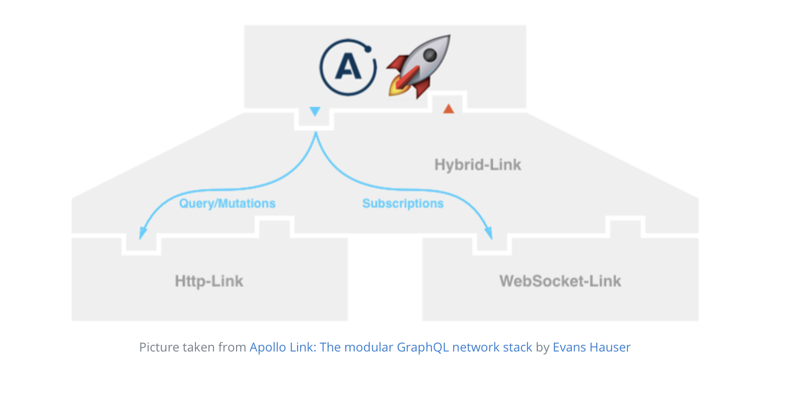

> * 原文地址：[Realtime Updates with GraphQL Subscriptions](https://www.howtographql.com/react-apollo/8-subscriptions/)
> * 译文来自：[Github:EmilyQiRabbit](https://github.com/EmilyQiRabbit/GraphQLTranslation)
> * 译者：[旺财](https://github.com/EmilyQiRabbit)
> * **Proofreading is welcomed** 🙋 🎉

# 使用 GraphQL Subscriptions 实现实时更新

这一章我们将学习如何使用 GraphQL Subscriptions 来完成应用的实时更新的功能。

## 什么是 GraphQL 订阅功能 (Subscriptions) ？

GraphQL 的 Subscriptions 即订阅功能，允许服务器在某个特定的事件（也就是订阅的事件）发生的时候，将信息推送给客户端。订阅通常是用 WebSockets 实现的，这时，服务器和客户端建立了长连接。这意味着，当使用 Subscriptions 时，你就打破了之前那些组件使用的那种：请求-应答 的循环，客户端通过指定某个感兴趣的事件，和服务器保持连接。每当改事件发生，服务器将使用这个长连接把信息推送给客户端。

## 使用 Apollo 完成订阅

如果使用 Apollo，你需要用订阅信息配置 ApolloClient。这就需要为 Apollo 中间件添加另外一个 ApolloLink。这一次是引用了 apollo-link-ws 包中的 WebSocketLink。

首先将它作为依赖引入 app。

在目录 react-apollo 下的控制台输入如下命令：

```
yarn add apollo-link-ws
...
yarn add subscriptions-transport-ws
```

下面，配置 ApolloClient，让它“知道”订阅服务的存在：

在 index.js 中添加如下代码：

```JavaScript
import { split } from 'apollo-link'
import { WebSocketLink } from 'apollo-link-ws'
import { getMainDefinition } from 'apollo-utilities'
```

注意这里从 'apollo-link' 中引入了 split 函数。

下面，创建 WebSocketLink，它代表 WebSocket 连接。并且使用 split 方法来对请求进行的“导航”，并更新 ApolloClient 调用的方法：

```JavaScript
const wsLink = new WebSocketLink({
  uri: `ws://localhost:4000`,
  options: {
    reconnect: true,
    connectionParams: {
      authToken: localStorage.getItem(AUTH_TOKEN),
    }
  }
})

const link = split(
  ({ query }) => {
    const { kind, operation } = getMainDefinition(query)
    return kind === 'OperationDefinition' && operation === 'subscription'
  },
  wsLink,
  authLink.concat(httpLink)
)

const client = new ApolloClient({
  link,
  cache: new InMemoryCache()
})
```

wsLink：如此便创建了 WebSocketLink 实例并且它绑定了订阅端口。这个例子中，订阅接口和 HTTP 接口其实很像，只是订阅功能使用的是 ws 协议而不是 http 协议。注意到，你也使用了用户的 token 信息来授权 websocket 连接。

split 函数用来将请求导航到特定的中间件。它需要三个参数，第一个是一个测试函数，返回一个布尔值。另外两个参数都是 ApolloLink 类型。如果测试函数返回了 true，那么请求将会使用第二个中间件，如果是 false，就使用第三个中间件。

这个例子中，测试函数将会检验请求是否是订阅请求。如果是，就会使用 wsLink 中间件函数，否则就用原来的 authLink.concat(httpLink) 中间件。



## 对新建 links 发起订阅

为了让应用能够在新的 link 被创建的时候实时更新，我们需要对使得 Link 类型发生变化的事件发起订阅。当使用 Prisma 的时候，下面三种事件可以订阅：

* 创建了新的 Link

* 更新一个已经存在的 Link

* 删除一个已经存在的 Link

我们将会在 LinkList 组件上应用 subscription，因为这里是所有 link 展示的地方。

更新 LinkList.js 的代码：

```JavaScript
class LinkList extends Component {
  _updateCacheAfterVote = (store, createVote, linkId) => {
    const data = store.readQuery({ query: FEED_QUERY })
  
    const votedLink = data.feed.links.find(link => link.id === linkId)
    votedLink.votes = createVote.link.votes
  
    store.writeQuery({ query: FEED_QUERY, data })
  }

  _subscribeToNewLinks = async () => {
    // ... you'll implement this 🔜
  }

  render() {
    return (
      <Query query={FEED_QUERY}>
        {({ loading, error, data, subscribeToMore }) => {
          if (loading) return <div>Fetching</div>
          if (error) return <div>Error</div>

          this._subscribeToNewLinks(subscribeToMore)
    
          const linksToRender = data.feed.links
    
          return (
            <div>
              {linksToRender.map((link, index) => (
                <Link
                  key={link.id}
                  link={link}
                  index={index}
                  updateStoreAfterVote={this._updateCacheAfterVote}
                />
              ))}
            </div>
          )
        }}
      </Query>
    )
  }
}
```

让我们来解析一下这段代码。我们依旧使用的是 <Query /> 组件，但是接受了一个新的参数 subscribeToMore。调用 _subscribeToNewLinks 函数来确保组件完成了事件的订阅。这个函数将会和订阅服务建立 ws 连接。

_subscribeToNewLinks 函数的实现如下：

```js
_subscribeToNewLinks = subscribeToMore => {
  subscribeToMore({
    document: NEW_LINKS_SUBSCRIPTION,
    updateQuery: (prev, { subscriptionData }) => {
      if (!subscriptionData.data) return prev
      const newLink = subscriptionData.data.newLink.node

      return Object.assign({}, prev, {
        feed: {
          links: [newLink, ...prev.feed.links],
          count: prev.feed.links.length + 1,
          __typename: prev.feed.__typename
        }
      })
    }
  })
}
```

subscribeToMore 方法需要两个参数：

1. document：代表了 subscription 请求本身。在这个例子中，subscription 将在 link 被创建的时候触发。

2. updateQuery：和 update 类似，这个函数允许你定义 store 在收到服务器的回应后如何更新信息。事实上，它和 Redux reducer 遵循同样的规则：它接受两个参数，store 中存储的旧状态以及服务器返回的订阅信息。接下来你可以决定如何将订阅信息合并到现有状态中，然后返回更新的数据。这里 updateQuery 函数做的事情就是从 subscriptionData 中获取新 link 的信息，将它合并到现有列表并返回结果。

最后，添加 NEW_LINKS_SUBSCRIPTION 相关的代码：

```js
const NEW_LINKS_SUBSCRIPTION = gql`
  subscription {
    newLink {
      node {
        id
        url
        description
        createdAt
        postedBy {
          id
          name
        }
        votes {
          id
          user {
            id
          }
        }
      }
    }
  }
`
```

> 运行报错的话，需要手动引用个包：yarn add subscriptions-transport-ws。

现在，你可以这样测试这个应用：打开两个窗口，第一个窗口访问 http://localhost:3000/，第二个窗口使用 playground 来发起 post mutation。当你发起了 post 请求，你就能看到 app 界面实时更新。

## 订阅新 votes

和订阅新 Link 很相似，详情可以直接去看 LinkList.js 的代码。

[self Proofreading +1]
