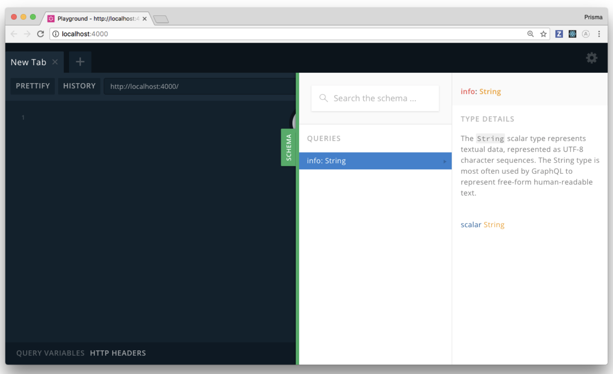
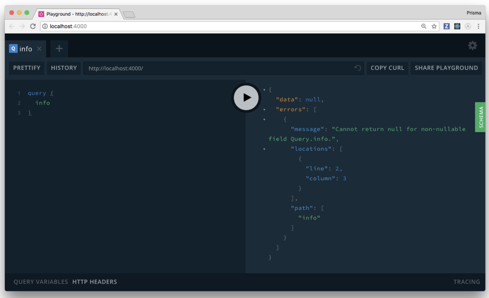

> * 原文地址：[Getting Started](https://www.howtographql.com/graphql-js/1-getting-started/)
> * 译文来自：[Github:EmilyQiRabbit](https://github.com/EmilyQiRabbit/GraphQLTranslation)
> * 译者：[Yuqi🌸](https://github.com/EmilyQiRabbit)
> * **欢迎校对** 🙋‍♀️🎉

# GraphQL-NODE 入门

在本章节中，我们将一起配置可用于 GraphQL 服务的项目，并实现一个 GraphQL 请求。最后，我们将会讲解一下 GraphQL 的原理并学习 [GraphQL 模式（schema）](https://blog.graph.cool/graphql-server-basics-the-schema-ac5e2950214e)。

## 创建项目

我们将会跟随教程一起学习如何从零开始搭建 GraphQL 服务，你要做的第一件事情是：创建一个目录，用于容纳服务所需的所有文件。

打开终端，导航到你选择放置项目的文件夹地址，然后运行如下命令：

```sh
mkdir hackernews-node
cd hackernews-node
yarn init -y
```

> 注：本篇教程使用 Yarn 管理项目，如果你更喜欢使用 npm，运行等价的 npm 命令即可。

上面的命令创建了一个名为 hackernews-node 的目录，同时完成初始化并创建了 package.json 文件。package.json 是 Node 应用的配置文件。文件罗列了项目的所有依赖，以及应用需要其他配置项（例如脚本：scripts）。

## 创建最简单的 GraphQL 服务

创建了项目目录文件，下一步我们创建 GraphQL 服务入口：一个名为 index.js 的文件，它位于 src 目录下。

在终端输入如下命令，它将会创建 src 目录然后创建一个空文件 index.js：

```sh
mkdir src
touch src/index.js
```

在 hackernews-node 目录下执行 `node src/index.js` 就可以启动应用。但是目前什么也不会发生，因为 index.js 还是一个空文件 `¯\_(ツ)_/¯`（皮一下很开心）。

现在我们可以开始构建 GraphQL 服务了！首先需要给项目添加依赖。

在终端执行：

```sh
yarn add graphql-yoga
```

graphql-yoga 是一个功能全面的 GraphQL 服务。graphql-yoga 基于 Express.js，能够帮助你搭建可用于生产环境的 GraphQL 服务。

如下是 graphql-yoga 的主要功能列表：

* 符合 GraphQL 规范
* 支持文件上传
* 实时 GraphQL 订阅功能
* 支持 TypeScript 类型
* 支持开箱即用的 GraphQL Playground
* 可通过 Express 中间件扩展
* 支持在 GraphQL 模式中处理自定义指令
* 可追踪查询性能
* 可接受两种 content-type：application/json 和 application/graphql
* 可以在任何环境下运行：可以通过 now, up, AWS Lambda, Heroku 等部署

完美，现在我们来写代码吧 🙌

打开 [src/index.js](https://github.com/howtographql/graphql-js/blob/master/src/index.js) 然后输入如下代码：

```js
const { GraphQLServer } = require('graphql-yoga')

// 1
const typeDefs = `
type Query {
  info: String!
}
`

// 2
const resolvers = {
  Query: {
    info: () => `This is the API of a Hackernews Clone`
  }
}

// 3
const server = new GraphQLServer({
  typeDefs,
  resolvers,
})
server.start(() => console.log(`Server is running on http://localhost:4000`))
```

下面我们逐一解释这段代码所完成的功能，注解前的序号和代码中注释的数字相对应：

1. 常量 typeDefs 定义了 GraphQL 模式（稍后我们会详细解释）。即定义了一个简单的 Query 类型，它仅有一个属性：info。这个属性对应类型 String!。类型定义中的声明符号 `!` 表示这个字段不能是空：`null`。

2. resolvers 对象是 GraphQL 模式的实现。不难注意到，它的结构和 typeDefs 常量内定义的 Query.info 类型结构一致。

3. 最后，模式和 resolvers 被绑定在一起然后传入 GraphQLServer，它是从 graphql-yoga 导入的。这个操作将告知服务什么样的 API 操作可被接受以及它们应该如何被处理。

现在，来测试一下这个 GraphQL 服务吧！

## 测试 GraphQL 服务

在项目的根目录下，运行如下命令：

```sh
node src/index.js
```

正如终端输出所示，服务现在运行在 http://localhost:4000。为了测试服务的 API，打开浏览器然后导航到这个地址。

你看到的是一个 GraphQL Playground，它是一个强大的“GraphQL IDE”，可用于测试 API 功能。

点击右侧的 SCHEMA 按钮就可以看到 API 文档。这个文档是根据你定义的模式（schema）自动生成的，能够显示模式中所有的 API 操作和数据类型。



下面让我们来发送一个 GraphQL 请求。在左侧的编辑面板上输入如下代码：

```graphql
query {
  info
}
```

然后点击位于中间位置的 Play 按钮，将这个请求发送给服务（快捷键是 CMD/CTRL+ENTER）。

...

恭喜恭喜，现在你已经成功的实现并测试了第一个 GraphQL query 请求 🎉

还记得之前我们说过的 `info: String!` 这样的定义，表示这个字段绝不能是空值 `null`。现在你已经成功实现了 resolver 函数，并且可以控制字段的值了。那么如果你在 resolver 的实现中偏偏返回了 `null` 的话，会发生什么呢？我们来试一下。

更新 index.js 中定义 resolvers 的代码：

```js
const resolvers = {
  Query: {
    info: () => null,
  }
}
```

为了测试本次修改的结果，你需要重启服务：首先用 **CTRL+C** 停止服务，然后运行 `node src/index.js` 重启服务。

现在，重新发送请求，这次，它返回了错误：`Error: Cannot return null for non-nullable field Query.info`。



造成错误的原因是，底层的 `graphql-js` 代码确保了 resolver 函数中的返回类型必须和 GraphQL 模式定义的类型一致。这样能防止开发者犯一些低级错误。

这实际也是 GraphQL 的最重要的优点之一：它强制 API 的行为和模式定义的一致。这样，所有看到 GraphQL 模式的人都能百分百的确定 API 操作以及 API 返回的数据结构。

## GraphQL 模式（schema）简介

GraphQL 模式是所有 GraphQL API 的核心。下面我们简单的介绍一下。

> 注：本篇教程只简单介绍 GraphQL 模式，不会深入讨论。如果你想要更加深入的学习模式和它在 GraphQL API 中的应用，可以参考[这篇很不错的文章](https://blog.graph.cool/graphql-server-basics-the-schema-ac5e2950214e)吧.

编码 GraphQL 模式的语法称为 GraphQL [模式定义语言](https://www.prisma.io/blog/graphql-sdl-schema-definition-language-6755bcb9ce51)（SDL）。SDL 的类型系统允许开发者定义数据结构（正如其他强类型语言 Java, TypeScript, Swift, Go 一样）。

这对 GraphQL 服务 API 的定义有何帮助呢？所有 GraphQL 模式都有三个特别的根（root）类型：`Query`, `Mutation` 和 `Subscription`。这 3 个基础类型分别负责 GraphQL 提供的三种操作类型：query，mutation 和 subscription。根类型下的字段被称为根字段（root field），它们定义了可用的 API 操作。

例如，刚才我们使用的简单的 GraphQL 模式：

```graphql
type Query {
  info: String!
}
```

这个模式仅有一个名为 info 的根字段。当发送 query, mutation 或者 subscription 给 GraphQL API 的时候，服务必须从根字段开始解析。这里我们仅有一个根字段，所以 API 就只接受一种 query，即 info。

我们来看一个稍微复杂的例子：

```graphql
type Query {
  users: [User!]!
  user(id: ID!): User
}

type Mutation {
  createUser(name: String!): User!
}

type User {
  id: ID!
  name: String!
}
```

这个例子中，我们有了三个根字段：Query 中有 users 和 user，Mutation 中有 createUser。另外还定义了 User 类型，以确保模式中类型完整（因为 Query 和 Mutation 中都用到了 User 类型）。

这样的模式定义可以支持哪些 API 操作呢？我们知道所有的 API 操作都必须以根字段开始。但是这里，根字段的类型是[对象类型（object type）](https://graphql.org/learn/schema/#object-types-and-fields)，那么 API 操作应该是什么样子呢？在这个例子中，根字段的类型分别是 [User!]!, User 和 User!。而在前面那个例子中，根字段 info 的类型是 String，它是一个[标量类型（scalar type）](http://graphql.org/learn/schema/#scalar-types)。

当 root field 是对象类型，你可以用这个类型的字段来继续扩展你的 query（或者 mutation/subscription）。这些扩展的部分称为可选集合（selection set）。

如下这些请求都可以被上述模式实现的 API 接受：

```graphql
# Query for all users
query {
  users {
    id
    name
  }
}

# Query a single user by their id
query {
  user(id: "user-1") {
    id
    name
  }
}

# Create a new user
mutation {
  createUser(name: "Bob") {
    id
    name
  }
}
```

另外还有几点需要注意：

* 这些例子中，我们都请求了 User 类型的 id 和 name。实际上，我们可以省略 id, name 的其中一个。注意，当请求一个对象类型数据时，至少要请求可选集合中的一个字段。

* 对于可选集合中的字段，根字段的类型是 required（即 `!`）或列表 list 都可以。在上面这个模式例子中，三个根字段的类型是不同的 User 类型的[类型修饰](https://graphql.org/learn/schema/#lists-and-non-null)（也就是 User 类型 required 和 list 的不同组合）：

  * 对于 `users` 字段，返回值是 `[User!]!`，意味着它返回的是一个 User 类型元素的 list 列表（同时该字段本身不能为空）。列表中也不能包含空元素。所以，你总能对数据接收方保证，该字段下它们不会收到空值，并且列表中也不会包含空元素。

  * 对于 `user(id: ID!)` 字段，返回的类型是 User 意味着，它可能是空值或者一个 User 类型的对象。

  * 对于 `createUser(name: String!)` 字段，返回类型是 `User!`，意味着必须返回 User 类型对象。

好了，理论知识讲得差不多了，我们来写写代码吧！
