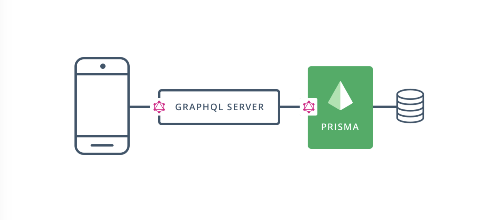

> * 原文地址：[Adding a Database](https://www.howtographql.com/graphql-js/4-adding-a-database/)
> * 译文来自：[Github:EmilyQiRabbit](https://github.com/EmilyQiRabbit/GraphQLTranslation)
> * 译者：[Yuqi🌸](https://github.com/EmilyQiRabbit)
> * **欢迎校对** 🙋‍♀️🎉

# 为服务添加数据库

这一章我们将会学习搭建 Prisma 服务并连接数据库，然后将其应用于 GraphQL 服务。

## 为何选择 Prisma

学到这一章，我们已经了解了 GraphQL 服务运作的基本原理，其实是非常简单的是吧？这正是 GraphQL 之美，它只需要遵循简单几条规则。强类型模式和服务内能够解析请求的 GraphQL 引擎，能够排除 API 开发中常见的痛点。

所以，构建 GraphQL 服务的难点是什么呢？

在实际应用中，开发者可能会遇到很多实现 resolver 函数会变得非常复杂的场景。尤其是因为 GraphQL 请求可以嵌套很深，这时实现 resolver 函数会变得很棘手，并容易导致性能问题。

大多数时候，你经常还需要考虑其他很多附加的工作流，比如认证、权限、分页、过滤操作、实时更新，以及整合第三方的服务或者历史遗留服务等等。

通常情况下，实现 resolver 函数并连接数据库时你会有两个选择 —— 但是这两个都不很完美：

1. 通过写 SQL 或者用其他非 SQL 数据库的 API。直接访问数据库。

2. 使用 [ORM](https://en.wikipedia.org/wiki/Object-relational_mapping)（即 Object-relational mapping），它可为开发者提供数据库摘要，让开发者能够直接从代码中访问数据库。

第一个方案是存在问题的：因为在 resolver 函数中直接处理 SQL 非常复杂，代码很快就会难以维护。另一个问题是 SQL 请求经常是以纯字符串的形式提交到数据库。字符串就是一系列字符，它没有任何结构可言。所以，你的工具没办法帮你发现代码中可能的错误，也没办法提供像自动填充这样的附加功能。因此写 SQL 语句就非常棘手，也非常容易出错。

第二个方案使用了 ORM，刚开始你可能会觉得是个不错的选择。但这个方案也存在缺点：当实现相对简单的数据库访问时，ORM 是可选的解决方案，但是由于 GraphQL 查询的复杂性以及可能出现的各种边界情况，ORM 就可能会出现问题。

为了解决这些问题，Prisma 提供了使用方便的数据访问层，它将会帮助你解析请求。当使用 Prisma 的时候，你所实现的 resolver 函数将会把传入的请求转发给 Prisma 引擎，并由 Prisma 引擎负责根据数据库中的数据解析请求。由于有了 [Prisma 客户端](https://www.prisma.io/docs/prisma-client/)，这个过程将会非常简单，所有的 resolver 函数只需一行代码就能实现。

## 结构

如图展示的，是使用 Prisma 构建 GraphQL 服务的结构：



Prisma 服务提供了应用的数据访问层，通过 Prisma，API 服务和数据库之间的交互变得容易了很多。Prisma 服务 API 将会被嵌入在 API 服务实现中的 Prisma 客户端访问（和 ORM 类似）。这里的 API 服务就是前几章中我们学习使用 `graphql-yoga` 构建的服务。

Prisma 的本质就是让你能轻松的将 API 服务中的 GraphQL resolver 函数和数据库连接起来。

## 基于示例数据库，建立 Prisma 服务

这部分教程中，我们将会学习如何从零开始，搭建一个完整的服务！而关于 Prisma 配置，我们将从尽可能最简单的开始。

首先我们需要创建两个文件，它们位于一个新的目录 prisma 下。

首先创建 prisma 目录，然后创建两个文件 prisma.yml 和 datamodel.graphql。执行如下命令：

```sh
mkdir prisma
touch prisma/prisma.yml
touch prisma/datamodel.graphql
```

prisma.yml 是 Prisma 服务的主要配置文件。datamodel.graphql 则包含了[数据模型](https://www.prisma.io/docs/-knul)的定义。Prisma 数据模型定义了应用的模型。每个模型都和数据库中的表关联。

到目前为止，你的 Hacker News 应用只包含了一种数据模型：Link。由于 Prisma 的模型定义也使用了 [GraphQL SDL](https://www.prisma.io/blog/graphql-sdl-schema-definition-language-6755bcb9ce51)，你可以将 Link 的定义直接从 schema.graphql 拷贝到 datamodel.prisma：

打开 [datamodel.graphql](https://github.com/howtographql/graphql-js/blob/master/prisma/datamodel.prisma) 并添加如下代码：

```graphql
type Link {
  id: ID! @id
  createdAt: DateTime! @createdAt
  description: String!
  url: String!
}
```

和 schema.graphql 文件中 Link 定义相比，这里有两个主要的区别。

首先，在 id: ID! 的后面添加了 @id 标识。这个标识意味着 Prisma 将会在数据库中，为 Link 的 id 字段自动生成并保存全局唯一 ID。

其次，我们还添加了一个新的字段：`createdAt: DateTime! @createdAt`。这个字段也是由 Prisma 负责管理的，并且在 API 中是只读的。它存储了每个 Link 类型的数据被创建的时间。你还可以使用 `@updatedAt` 来标记字段，此时 Prisma 将会记录数据最后更新的时间。

现在，我们来看看如何处理 prisma.yml。

在 prisma.yml 中添加如下的内容：

```yml
# The HTTP endpoint for your Prisma API
endpoint: ''

# Points to the file that contains your datamodel
datamodel: datamodel.prisma

# Specifies language & location for the generated Prisma client
generate:
  - generator: javascript-client
    output: ../src/generated/prisma-client
```

想要学习更多关于 prisma.yml 的结构，可以查看[官方文档](https://www.prisma.io/docs/-5cy7#reference)

这里是对代码的简单解析：

* endpoint：Prisma API 的 HTTP 接口。

* datamodel：指明数据模型的存储位置，它是 Prisma API 接口的基础。

* generate：定义生成 Prisma 客户端的语言，以及存储的位置。

部署服务之前，还需要安装 Prisma CLI。

在终端运行如下命令，全局安装 Prisma CLI：

```sh
yarn global add prisma
```

完成了，现在万事具备，可以部署这个连接了数据库的 Prisma 服务了 🙌！注意，本篇教程将会使用一个位于 Prisma 云端的免费的示例数据库 [AWS Aurora](https://aws.amazon.com/de/rds/aurora/)。如果你想要学习更多关于本地配置 Prisma，或使用本地数据库的方式，可以查看[这篇文档](https://www.prisma.io/docs/-a002/)。

下面我们在 hackernews-node 目录下执行 prisma deploy：

```sh
prisma deploy
```

命令将会开始一个需要交互的过程：

1. 首先选择 Demo server。在弹出的浏览器中使用 Prisma Cloud 注册然后回到控制台。

2. 然后需要选择 Demo server 的区域。你可以直接按两次回车来使用服务推荐的配置值。

> 注：Prisma 是开源的，你可以使用 Docker 部署在任何一个云服务上。

命令执行结束后，CLI 会将 Prisma API 的端口写入到 prisma.yml 文件中，它差不多会像这样：https://eu1.prisma.sh/john-doe/hackernews-node/dev

最后一步是为数据模型生成 Prisma 客户端。Prisma 客户端是一个自动生成的客户端仓库，它让开发者可以通过 Prisma API 从数据库中读写数据。你可以使用 prisma generate 命令生成该客户端。这个命令将会根据 prisma.yml 文件中的信息生成 Prisma 客户端。

在 /prisma 目录下执行：prisma generate

现在，Prisma 客户端已经生成，并保存于 `hackernews-node/src/generated/prisma-client` 目录下。你要在需要它的地方，导入 prisma 实例。这是一段 nodejs 的示例代码：

```js
const { prisma } = require('./generated/prisma-client')

async function main() {

  // Create a new link
  const newLink = await prisma.createLink({ 
    url: 'www.prisma.io',
    description: 'Prisma replaces traditional ORMs',
  })
  console.log(`Created new link: ${newLink.url} (ID: ${newLink.id})`)

  // Read all links from the database and print them to the console
  const allLinks = await prisma.links()
  console.log(allLinks)
}

main().catch(e => console.error(e))
```

下一章，我们将会升级 GraphQL 服务的 API，并在 resolver 函数中使用 Prisma 客户端访问数据库。
