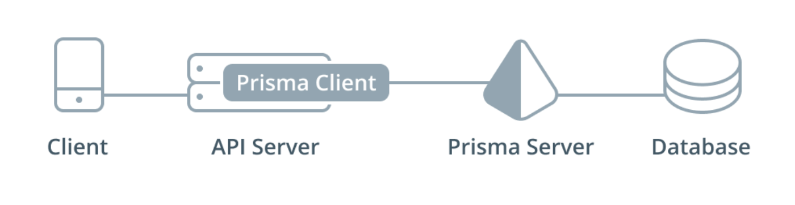

> * 原文地址：[Adding a Database](https://www.howtographql.com/graphql-js/4-adding-a-database/)
> * 译文来自：[Github:EmilyQiRabbit](https://github.com/EmilyQiRabbit/GraphQLTranslation)
> * 译者：[旺财](https://github.com/EmilyQiRabbit)
> * **Proofreading is welcomed** 🙋 🎉

# 添加数据库

在这一部分，你将会建立起 Prisma 服务以及服务连接的数据库。

## 为什么选择 Prisma

目前为止，你已经知道了 GraphQL 服务的基本原理，非常简单的是吧？这正是 GraphQL 美好之处，只需要遵循简单几条规则。强类型模式的 schema 和能 resolve query 的 GraphQL 引擎，避免了 API 开发中的常见痛点。

接下来，构建 GraphQL 服务的难点在哪里呢？

在实际应用中，你可能会遇到很多情境：这些情境下，resolver 的实现可能会非常复杂。尤其是 GraphQL 的请求可能会有很深的嵌套、那么 resolver 的实现可能就会比较 tricky，也容易导致性能问题。

大多数时候，你经常还需要考虑其他很多附加的工作流，比如认证、权限、分页、过滤操作、实时和第三方的服务或者遗留的服务整合等等。

通常，当实现 resolver 并连接数据库的时候，你有两个选择、但是这两个都不很完美：

1. 直接连接数据库（写 SQL 或者用其他非 SQL 数据库 API）。

2. 使用 ORM（Object-relational mapping），它可以提供数据库摘要，让你能够直接从代码中访问。

第一个方案是存在问题的，因为在 resolver 中直接处理 SQL 非常复杂，很容易就会把代码搞得难以维护。另一个问题是，SQL 请求经常是以字符串的形式提交到数据库。字符串没有任何结构可言，它们就是一系列字符。所以，你的工具没办法帮你发现代码中可能的错误，也没办法提供像自动填充这样的附加功能。那么这样，写 SQL 语句就非常棘手、非常容易出错。

第二个方案使用了 ORM，可能你会觉得是个不错的选择。但是，这个方案也有致命缺点。ORMs 通常存在这样的问题：它是实现相对简单的数据库访问的解决方案，但是由于 GraphQL 查询的复杂性以及可能出现的各种边界情况，所以使用 GraphQL 时就无法正常工作了。

Prisma 提供了 GraphQL 查询引擎来专门处理 resolve 请求，从而解决了这个问题。当使用 Prisma 的时候，解析器的运行，其实只是将传入的查询委托给底层的 Prisma 引擎。多亏了 Prisma bindings，请求委托将会是一个很简单的过程，所有的 resolver 都可以用一行代码就实现。

> Prisma binding 基于 schema 的委托和拼接的思想。本教程中，我们将不会深入到这些技术的细节，如果你想了解更多，可以看看下面这两篇文章：
> [GraphQL Schema Stitching explained: Schema Delegation](https://blog.graph.cool/graphql-schema-stitching-explained-schema-delegation-4c6caf468405)
> [Reusing & Composing GraphQL APIs with GraphQL Bindings](https://blog.graph.cool/reusing-composing-graphql-apis-with-graphql-bindings-80a4aa37cff5)

## 结构

下面这个图就是使用 Prisma 构建 GraphQL 服务时的结构。



知道这个结构非常重要，在这个结构中你需要处理两个(!) GraphQL API 层。

### 应用层

第一个 GraphQL API 就是在前几篇教程中你已经开始搭建的部分。这个是应用层的 GraphQL API。它定义了客户端应用将要访问的 API。在这一层你可以实现事物逻辑、工作流、认证和授权或者和第三方服务整合。应用层的 API 在 src/schema.graphql 文件中由 GraphQL schema 定义 - 从现在起我们就将这个 schema 称为**应用 schema**。

### 数据库层

第二个 GraphQL API 是 Prisma 提供的，它提供了数据库层。这个基本上就是一个基于 GraphQL 的数据库接口，帮你省去了写 SQL 的繁琐。那么，这个 GraphQL API 长什么样子呢？

Prisma API 是一个镜像数据库 API，所以它允许你对特定数据类型进行增删改查的操作。什么是数据类型？这将取决于你 - 你可以用你很熟悉的 SDL 定义这些数据类型。后面你将会学习它是如何工作的。

通常情况下，这些数据类型代表了你应用的实体。比如，你正在搭建一个汽车经销商软件，那你就可能会有 Car, CarDealer, Customer 这样的数据类型。所有这样的数据类型的集合就是你的数据模型。

一旦你的数据模型定义了，Prisma 就会把它翻译为一个相应的数据库 schema，然后基于此配置好数据库。当你接下来向 Prisma GraphQL API 发送 queries 和 mutations 时，它就会自动的把这些翻译为数据库操作然后运行这些操作。简单明了哈～

之前我们已经学习了，所有的 GraphQL APIs 都有一个 GraphQL schema 来支持。所以谁来为 Prisma GraphQL API 提供 schema 呢？答案是，它将会基于你提供的数据模型被自动生成。所以，这个 schema 也被称为 Prisma database schema。

这是一个例子，考虑一个很简单的数据模型，它有一个 User 类型：

```js
type User {
  id: ID! @unique
  name: String!
}
```

> 先别管 @unique 标识，我们后续会说。

基于这个数据模型，Prisma 将会生成一个像这样的 GraphQL schema：

```js
type Query {
  users(where: UserWhereInput, orderBy: UserOrderByInput, skip: Int, after: String, before: String, first: Int, last: Int): [User]!
  user(where: UserWhereUniqueInput!): User
}

type Mutation {
  createUser(data: UserCreateInput!): User!
  updateUser(data: UserUpdateInput!, where: UserWhereUniqueInput!): User
  deleteUser(where: UserWhereUniqueInput!): User
}

type Subscription {
  user(where: UserSubscriptionWhereInput): UserSubscriptionPayload
}
```

实际上的 schema 还要更大一些 - 这里为了简单期间我们就只包含了三个 root 类型以及简单的增删改查操作。但是其实 API 还允许其他很多操作（比如批量更新和删除）。如果你感兴趣，可以查看[这里](https://gist.github.com/gc-codesnippets/3f4178ad93c51d03195c92ce119d444c)。

### 为什么不直接使用 Prisma GraphQL API？

Prisma 其实就是一个数据库接口。如果你直接用前端或者移动端连接 Prisma，那就像是直接连接数据库了。

在极少的情况下，也许这也是个选择：但是大多数的应用还是必须要一个不仅仅包含增删改查的附加的逻辑层（数据校验、权限、第三方服务整合等等都需要在这一层处理）。

将 Prisma 接口直接暴露给客户端的另一个潜在问题就是安全性。GraphQL 的工作方式就是，谁能够访问 GraphQL 接口终端，谁就能够从这个端口追溯整个 schema。这被称为：内省。如果你的客户端直接和 Prisma 连接，那么通过检查网络请求就能很简单的获取到 Prisma API 的端口，然后所有用户都能看到你数据库的所有 schema 了。

> 最近，关于是否应该限制自省功能一直有争论，但是目前为止还没有什么方案。

## 基于一个已连接的数据库，建立 Prisma 服务

在这部分教程中，你将会从头开始并搭建好一切！关于 Prisma 数据库服务，你将从可能的最简单的设置开始。

首先，需要创建两个文件，这两个文件放在一个新的目录下，目录的名字是 database。

这两个文件的名字是 prisma.yml 和 datamodel.graphql，创建的方式就是在命令行执行如下代码：

```
mkdir database
touch database/prisma.yml
touch database/datamodel.graphql
```

prisma.yml 是你的 Prisma 数据库服务的主要配置文件。
另一方面，datamodel.graphql 则包含了数据模型的定义，它将会是 Prisma 生成 GraphQL CRUD API 的基础。

目前位置，你的 Hacker News app 的数据模型可能只包含一种数据类型：Link。事实上，你可以直接把 Link 的定义从 schema.graphql 拷贝到 datamodel.graphql。

打开 datamodel.graphql 并添加如下代码：

```
type Link {
  id: ID! @unique
  createdAt: DateTime!
  description: String!
  url: String!
}
```

相比于之前 schema.graphql 中的 Link，这里的 Link 有两个主要的区别。

首先，在 id: ID! 的后面添加了 @unique 标识。这个标识告诉 Prisma：任何两个数据库中的 Link 元素的这个字段都不能重复。实际上，id: ID! 在 Prisma 数据模型中是一个很特殊的字段，因为 Prisma 将会自动的生成全局唯一 ID 并提供给有这个字段的数据。

其次，我们还添加了一个新的字段：createdAt: DateTime!。这个字段也是 Prisma 负责管理的，并且在 API 中是只读的。它存储了每个 Link 被创建的时间。注意，Prisma 还提供另一个相似的字段，updatedAt: DateTime：它存储了 Link 的最后更新时间。

现在，我们来看看你需要如何处理 prisma.yml：

添加如下的内容：

```
# The service name, this will be part of the endpoint of the Prisma API
service: hackernews-node

# The deployment stage, this will also be part of the API endpoint
stage: dev

# Points to the file that holds your data model
datamodel: datamodel.graphql

# You can only access the API when providing JWTs that are signed with this secret
secret: mysecret123
```

想要学习更多关于 prisma.yml 的结构，可以查看[文档](https://www.prisma.io/docs/reference/service-configuration/prisma.yml/yaml-structure-ufeshusai8/)

这里是关于上面这个文件的快速解析：

* service：选一个你认为合适的服务名。

* stage：用于区分服务不同的部署阶段，它的值可以是任意字符串，不过一般都是：dev，staging 或者 prod。

* secret：为了保护你的 Prisma 服务，要求对 Prisma 发起的请求都必须需要做认证。这个 secret 用来签署 JWTs，它需要被包含在向 Prisma 发起的 HTTP 请求的 Authorization 头部。[阅读这里](https://www.prisma.io/docs/reference/prisma-api/concepts-utee3eiquo/#authentication)了解更多。

下一步，就是安装 Prisma CLI，用于管理 Prisma 服务。

在终端运行如下命令

```
yarn global add prisma@1.6.3
```

好了～现在你终于准备好可以部署你的 Prisma 服务了，同时你将连接到数据库。

在 database 目录下运行 prisma deploy。

命令将会指示你选择一个 cluster 用于部署 Prisma 服务。本教程中你将会使用 development cluster，它是完全免费的。

> Prisma 是开源的，它基于 Docker，意味着你可以部署在你选择的任何一个云服务上。如果你不想要处理 DevOps 和 Docker 的手工配置，你也可以使用 Prisma Cloud 来运行一个私人的 cluster 用于部署服务。具体可以查看这段[视频](https://www.youtube.com/watch?v=jELE4KXJPn4)。

在 CLI 的指示中选择任何一个 Development cluster 选项然后按回车（如果你本地有安装 Docker，你也可以在本地部署）。

（待续）