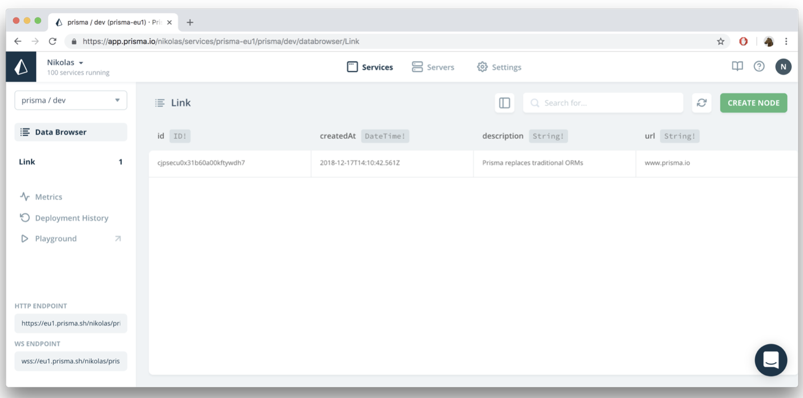

> * 原文地址：[Connecting Server and Database with Prisma Bindings](https://www.howtographql.com/graphql-js/5-connecting-server-and-database/)
> * 译文来自：[Github:EmilyQiRabbit](https://github.com/EmilyQiRabbit/GraphQLTranslation)
> * 译者：[Yuqi🌸](https://github.com/EmilyQiRabbit)
> * **欢迎校对** 🙋‍♀️🎉

# 使用 Prisma 客户端，连接服务与数据库

这一章我们将学习如何连接 Prisma API 和 GraphQL 服务，Prisma API 可以提供数据库接口。我们使用 Prisma 客户端完成连接。

## 更新 resolver 函数，以便使用 Prisma 客户端

首先我们需要做一些清理和重构的工作。

打开 index.js 然后移除 links 数组和 idCount 变量的所有代码 -- 你不再需要这些了，因为数据将会被保存在数据库中。

下一步，我们需要更新 resolver 函数，因为它们现在还在访问刚才已经删除了的变量。而且我们希望数据是从数据库返回的，而不是使用本地假数据。

在文件 [index.js](https://github.com/howtographql/graphql-js/blob/master/src/index.js) 中，更新 resolvers 对象的代码。

```js
const resolvers = {
  Query: {
    info: () => `This is the API of a Hackernews Clone`,
    feed: (root, args, context, info) => {
      return context.prisma.links()
    },
  },
  Mutation: {
    post: (root, args, context) => {
      return context.prisma.createLink({
        url: args.url,
        description: args.description,
      })
    },
  },
}
```

哇哦，看上去好奇怪！有很多新的内容出现了，现在我们来学习这部分的代码，从 feed resolver 函数开始。

### context 参数

之前的 feed resolver 函数没有任何参数 —— 但是现在有四个。事实上，前两个和第四个在这个 resolver 函数中都并不需要，重要的是第三个，context。

还记得我们之前说过的：所有的 GraphQL resolver 函数都能接受四个参数。现在要再学习一个参数 -- 所以 context 可以用来做什么呢？

context 参数是一个 JavaScript 对象，resolver 链中所有 resolver 函数都能对它进行读出和写入操作 -- 因而它基本上就是 resolver 函数之间进行交流的方法。稍后你会看到，当 GraphQL 服务本身刚被初始化的时候，context 就可以被写入了。所以，它也是开发者可以给所有 resolver 函数传递任意的数据或函数的方法。在本篇文章的例子中，你将会绑定 context 和 prisma 客户端示例 —— 稍后我们会详细解说。

> 注：本篇教程不会覆盖到 resolver 函数的所有四个参数。如果你想要更深入的学习，可以阅读下面两篇文章：

> [GraphQL Server Basics: The Schema](https://blog.graph.cool/graphql-server-basics-the-schema-ac5e2950214e)

> [GraphQL Server Basics: Demystifying the info Argument in GraphQL Resolvers](https://www.prisma.io/blog/graphql-server-basics-demystifying-the-info-argument-in-graphql-resolvers-6f26249f613a/)

现在你对 resolver 函数的参数已经有了基本的了解，我们来看看它们在 resolver 函数中是如何被应用吧。

### 理解 feed resolver 函数

feed resolver 函数的实现：

```js
feed: (root, args, context, info) => {
  return context.prisma.links()
},
```

它获取了 context 上的 prisma 对象。你将会看到，prisma 对象实际上就是一个来自 prisma 客户端实例，并从生成的 prisma-client 中引入。

这个 Prisma 客户端实例可以让你通过 Prisma API 高效访问数据库。它暴露出了一系列方法，让你能对模型做任何增删改查（CRUD）的操作。

### 理解 post resolver 函数

post resolver 函数如下：

```js
post: (root, args, context) => {
  return context.prisma.createLink({
    url: args.url,
    description: args.description,
  })
},
```

和 feed resolver 相似，我们发起了 prisma 客户端实例上的函数 createLink，该函数是 context 的属性。

我们发起了 Prisma 客户端 API 的 createLink 方法。并将 resolver 函数收到的数据通过 args 参数，作为参数传入这个方法。

总结一下，Prisma 客户端暴露了数据模型中模型的增删改查 API，开发者可用于读写数据库。这些方法是基于 `datamodel.prisma` 文件中定义的模型自动生成的。

但是，我们如何确定 resolver 函数实际可以访问这个神奇的 prisma 客户端实例了呢？

## 将 context 与生成的 Prisma 客户端绑定

在其他步骤之前，我们先做所有 JavaScript 开发者都最喜欢的步骤：为项目添加一个新的依赖 😑。

在项目的根目录 hackernews-node 下，运行如下命令

```sh
yarn add prisma-client-lib
```

我们需要这个依赖，好让自动生成的 Prisma 客户端能正常工作。

现在，我们可以将 context 与生成的 Prisma 客户端实例绑定，这样在 resolver 函数中就可以访问到它。

首先，在 index.js 中引入 prisma 客户端实例。在文件第一行加入如下代码：

```js
const { prisma } = require('./generated/prisma-client')
```

现在，可以在 GraphQLServer 初始化的时候将 prisma 和 context 绑定。

更新 [index.js](https://github.com/howtographql/graphql-js/blob/master/src/index.js)，将 GraphQLServer 初始化修改为：

```js
const server = new GraphQLServer({
  typeDefs: './src/schema.graphql',
  resolvers,
  context: { prisma },
})
```

上面的代码初始化了 context 对象，它会被传递到所有 GraphQL 的 resolver 函数中。由于你在初始化的时候为 GraphQLServer 绑定了 prisma 客户端的实例，因此你可以在所有 resolver 函数中访问到 context.prisma。

## 测试

代码修改已经完成了，我们可以开始测试新的、连接了数据库的代码实现是否可以正常工作。和往常一样，运行如下命令，启动 GraphQL 服务：

```sh
node src/index.js
```

然后我们打开 `http://localhost:4000` 的 GraphQL 练习场。发送和之前一样的 feed query 和 post mutaiton 请求。但不同的是，这次提交的信息将会被保存在 Prisma 云端的示例数据库中。而且在重启服务之后，feed query 依旧能返回正确的结果。

> 注：因为我们使用了 Prisma 云上的示例数据库，你可以在 [Prisma Cloud Console](https://app.prisma.io) 看到保存的数据。


