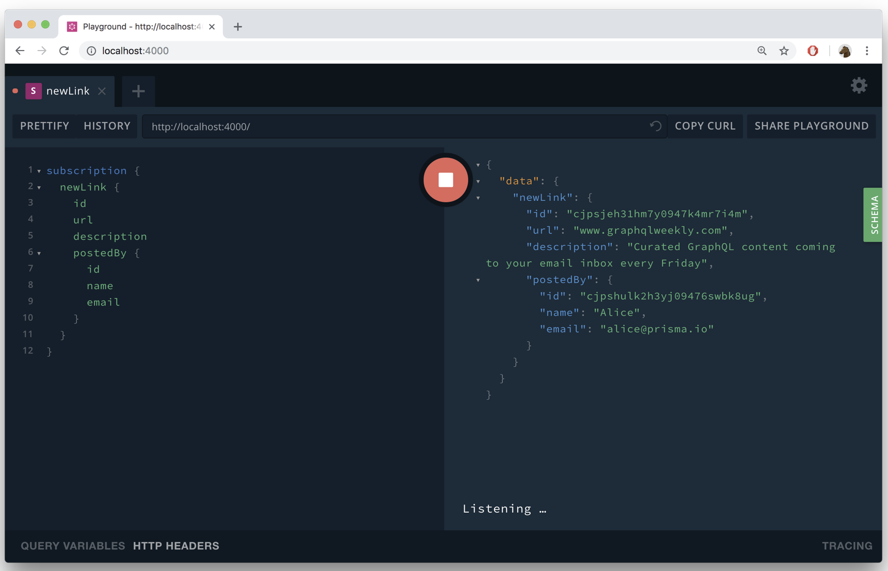

> * 原文地址：[Realtime GraphQL Subscriptions](https://www.howtographql.com/graphql-js/7-subscriptions/)
> * 译文来自：[Github:EmilyQiRabbit](https://github.com/EmilyQiRabbit/GraphQLTranslation)
> * 译者：[Yuqi🌸](https://github.com/EmilyQiRabbit)
> * **欢迎校对** 🙋‍♀️🎉

# GraphQL subscription 实时订阅

这一章节我们将会学习如何通过实现 GraphQL subscription 为应用加入实时更新的功能。我们的目标是在 GraphQL 服务中实现两个可以暴露给外部的的的订阅功能：

* 当一个新的 Link 类型元素被创建的时候，为已订阅客户端推送实时更新。

* 当一个已存在的 Link 类型元素被点赞的时候，为已订阅客户端推送实时更新。

## 什么是 GraphQL 订阅？

订阅（subscriptions）是 GraphQL 的一项功能，它允许服务端在某些特定事件发生的时候，向客户端推送数据。订阅功能通常使用 [WebSockets](https://en.wikipedia.org/wiki/WebSocket) 实现。这时，服务端与参与订阅的客户端之间会维持稳定连接。它打破了之前所有 API 的“请求-回复”这样的交互模式。

客户端通过发送一个指明订阅事件的 subscription 请求，就可以开始与服务端的长连接。每次这个指定的事件发生的时候，服务端就会使用这个连接，向已订阅客户端推送事件相关数据。

## 使用 Prisma 完成订阅

幸运的是，Prisma 提供了开箱即用的订阅功能。

Prisma 数据模型（datamodel）中每个模型的如下 3 个事件都可以被订阅：

* 新模型被创建

* 模型被更新

* 模型被删除

你可以通过使用 Prisma 客户端的 `$subscribe` 方法订阅上述事件。

## 订阅新建 Link 类型元素事件

下面我们来进入实战，写一写代码。我们将要实现一个允许客户端订阅新建 Link 元素事件的订阅函数。

和 query 和 mutation 一样，第一步是扩充 GraphQL 模式定义。

打开应用的 schema 并添加 Subscription 类型：

```graphql
type Subscription {
  newLink: Link
}
```

下面实现 newLink 字段的 resolver 函数。subscription 的 resolver 函数与 query 和 mutation 的稍有区别：

1. 它不会直接返回任何数据，而是会返回一个异步迭代器 (AsyncIterator)，随后它将会被 GraphQL 服务用来向客户端推送数据。

2. subscription 的 resolver 函数被一个对象包裹，并且需要作为 subscribe 字段的值。你也需要提供另一个名为 resolve 的字段，这个字段会返回来自异步迭代器生成的数据。

下面，为了延续前文模块化结构的代码实现，我们新建一个名为 Subscription.js 的文件：

```sh
touch src/resolvers/Subscription.js
```

下面是实现 subscription resolver 的代码：

```js
function newLinkSubscribe(parent, args, context, info) {
  return context.prisma.$subscribe.link({ mutation_in: ['CREATED'] }).node()
}

const newLink = {
  subscribe: newLinkSubscribe,
  resolve: payload => {
    return payload
  },
}

module.exports = {
  newLink,
}
```

代码很简洁。正如前面提到的，subscription resolver 作为 JavaScript 对象 newLink 中， subscribe 字段的值。

正如前文所说，context 对象属性 Prisma 客户端实例也暴露了 $subscribe 属性，用来代理 Prisma API 的订阅功能。这个方法可以解析 subscription 请求并推送数据。Prisma 会处理好所有实时更新功能的复杂逻辑。

打开 index.js 然后导入 Subscription 模块：

```js
const Subscription = require('./resolvers/Subscription')
```

然后更新 resolver 对象的定义：

```js
const resolvers = {
  Query,
  Mutation,
  Subscription,
  User,
  Link,
}
```

## 测试订阅功能

完成上述代码后，让我们来测试一下这个实时更新 API ⚡️。你可以通过同时使用两个 GraphQL Playground 实例（窗口）来进行测试。

* 首先使用 CTRL+C 停止服务，然后再次运行 `node src/index.js` 重启服务。

* 第二步，打开两个浏览窗口并全都打开地址：`http://localhost:4000`

你将要使用第一个 GraphQL Playground 发送订阅请求，此时它将会和服务端建立一个稳定连接的 websocket。使用第二个 Playground 发送 mutation 请求触发订阅。

在第一个 Playground 中，发送如下订阅请求：

```graphql
subscription {
  newLink {
    node {
      id
      url
      description
      postedBy {
        id
        name
        email
      }
    }
  }
}
```

和发送 query 以及 mutation 请求不同，发送 subscription 请求不会马上看到返回的结果。相反，界面上将会显示一个旋转的 loading 标识，表示服务端在等待订阅事件的发生。

是时候触发一个订阅事件了。

在另一个 GraphQL Playground 中发送如下 mutation 请求。记得需要首先为 Playground 请求授权（授权具体操作可参见前一章）。

```graphql
mutation {
  post(
    url: "www.graphqlweekly.com"
    description: "Curated GraphQL content coming to your email inbox every Friday"
  ) {
    id
  }
}
```

现在，可以去看看发送订阅请求的 Playground 窗口中发生了什么？



## 添加点赞功能

### 实现点赞 mutation

点赞功能允许用户为特定的新闻链接点赞。第一步是扩展 Prisma 数据模型，用来在数据库中表示点赞。

打开 `database/datamodel.graphql` 并调整为：

```graphql
type Link {
  id: ID! @id
  createdAt: DateTime! @createdAt
  description: String!
  url: String!
  postedBy: User
  votes: [Vote!]!
}

type User {
  id: ID! @id
  name: String!
  email: String! @unique
  password: String!
  links: [Link!]!
  votes: [Vote!]!
}

type Vote {
  id: ID! @id
  link: Link!
  user: User!
}
```

我们在数据模型中添加了一个新的 Vote 类型。它和 User 类型以及 Link 类型都是是一对多的关系。

为了应用这些变化，同时更新 Prisma 客户端 API，使其也加入 Vote 类型的增删改查操作，你需要重新部署服务。

```sh
prisma deploy
```

我们已经时刻牢记了模式驱动的开发流程，那么下一步就是扩展应用的模式定义，让 GraphQL 服务暴露出一个 vote mutation 接口：

修改 schema.graphql 文件

```graphql
type Mutation {
  post(url: String!, description: String!): Link!
  signup(email: String!, password: String!, name: String!): AuthPayload
  login(email: String!, password: String!): AuthPayload
  vote(linkId: ID!): Vote
}
```

Vote 类型也要在 schema.graphql 文件中定义：

```graphql
type Vote {
  id: ID!
  link: Link!
  user: User!
}
```

服务应该允许客户端依靠 Link 信息请求所有与其相关的 Vote 数据，所以我们还要更新 Link 类型：

```graphql
type Link {
  id: ID!
  description: String!
  url: String!
  postedBy: User
  votes: [Vote!]!
}
```

下一步，实现相关的 resolver 函数。

在 `src/resolvers/Mutation.js` 中添加如下函数：

```js
async function vote(parent, args, context, info) {
  // 1
  const userId = getUserId(context)

  // 2
  const linkExists = await context.prisma.$exists.vote({
    user: { id: userId },
    link: { id: args.linkId },
  })
  if (linkExists) {
    throw new Error(`Already voted for link: ${args.linkId}`)
  }

  // 3
  return context.prisma.createVote({
    user: { connect: { id: userId } },
    link: { connect: { id: args.linkId } },
  })
}
```

代码解析：

1. 和 post resolver 类似，第一步是通过 getUserId 函数认证请求的 jwt。如果认证成功，函数将会返回发起请求的用户的 userId，如果认证失败，函数将会抛出错误。

2. 你可能不太熟悉 `prisma.$exists.vote(...)` 函数。Prisma 客户端实例不仅仅暴露模型的增删改查方法，还可以为每个模型生成 `$exists` 函数。该函数接受一个 where 过滤参数，允许你定义该类型元素的特定的条件。当满足条件的元素存在于数据库时，`$exists` 函数将会返回 true。在上文的例子中，我们使用 `$exists` 函数来保证发起请求的用户还没有为这个新闻链接，即该 Link 元素点赞过。

3. 如果 `$exists` 函数返回了 false，createVote 方法将会创建一个新的 Vote 元素，并与 User 和 Link 实例相关联。

同时，别忘了在 export 语句中添加 vote resolver：

```js
module.exports = {
  post,
  signup,
  login,
  vote,
}
```

要时刻要牢记，GraphQL 模式中不同类型间的关联。因此我们也需要为这些关联实现 resolver 函数：

在 `resolver/Link.js` 中添加：

```js
function votes(parent, args, context) {
  return context.prisma.link({ id: parent.id }).votes()
}

//...

module.exports = {
  postedBy,
  votes,
}
```

最后，Vote 类型中与 user 和 link 相关联的字段也需要 resolver 函数：

在 resolvers 目录下新建一个 Vote.js 文件：

```sh
touch src/resolvers/Vote.js
```

然后添加如下代码：

```js
function link(parent, args, context) {
  return context.prisma.vote({ id: parent.id }).link()
}

function user(parent, args, context) {
  return context.prisma.vote({ id: parent.id }).user()
}

module.exports = {
  link,
  user,
}
```

最后更新 index.js

```js
const Vote = require('./resolvers/Vote')

//...

const resolvers = {
  Query,
  Mutation,
  Subscription,
  User,
  Link,
  Vote,
}
```

### 订阅点赞事件

本章最后一个任务，就是为新建投票添加 subscription 功能。方法和 newLink query 类似。

为应用模式的 Subscription 添加一个新的字段：

```graphql
type Subscription {
  newLink: Link
  newVote: Vote
}
```

然后，为 newVote 添加 resolver 函数，修改 `resolvers/Subscription.js`：

```js
function newVoteSubscribe(parent, args, context, info) {
  return context.prisma.$subscribe.vote({ mutation_in: ['CREATED'] }).node()
}

const newVote = {
  subscribe: newVoteSubscribe,
  resolve: payload => {
    return payload
  },
}
```

并更新 export 语句：

```js
module.exports = {
  newLink,
  newVote,
}
```

一切就绪，下面可以开始测试 newVote 的订阅功能了！

订阅请求：

```graphql
subscription {
  newVote {
    id
    link {
      url
      description
    }
    user {
      name
      email
    }
  }
}
```

vote mutation 请求：

```graphql
mutation {
  vote(linkId: "__LINK_ID__") {
    link {
      url
      description
    }
    user {
      name
      email
    }
  }
}
```
